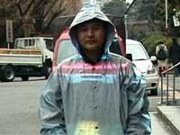

  
Increíble, pero fijaros (si podéis :-)) en el efecto óptico conseguido por estos japoneses:

[http://projects.star.t.u-tokyo.ac.jp/projects/MEDIA/xv/oc.html](http://projects.star.t.u-tokyo.ac.jp/projects/MEDIA/xv/oc.html)

Se podría usar para la casa del terror de las ferias, los espectros estarían muy conseguidos…