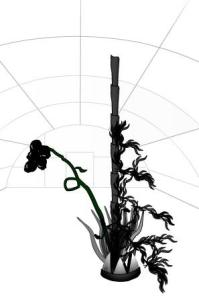

Mirando el blog de un amigo, me ha llamado la atención la siguiente web:  
[  
http://www.organichtml.com/](http://www.organichtml.com/)

Esta te crea una representación biológica de tu página web a partir de su contenido. Os dejo la primera que he realizado de mi blog. En Agosto volveré a crear otra, haber si ha crecido 🙂

(gracias [Sergio](http://www.sergio-alvarez.com/))