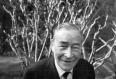
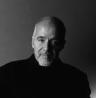
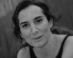
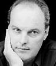
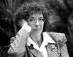
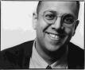

Queridos compañeros,

acaba de comenzar el mes de Agosto, un tiempo de tranquilidad, reflexión y diversión. Y como no, muchos de nosotros acompañamos este tiempo con una buena lectura. Yo os quisiera recomendar unos libros que los he disfrutado mucho, y en sorpresa de la gente que me conoce, hasta me los he acabado…

El primero de ellos es *“El Carrer Estret”* de **Josep Pla**. Son las historias de los vecinos de un nuevo foráneo, el veterinario sustituto de en un pequeño pueblo catalán de principios de siglo XX. Magistralmente escrito, fresco y divertido.

Un clásico de los escolares, que yo he tenido oportunidad de disfrutar años siguientes a esta etapa: *“El Alquimista”* de **Paulo Coelho**. Es un cuento precioso que reflexiona alrededor de nuestras vidas y sus destinos. Hará dos años que lo leí y lo disfruté como un niño.

Cambiando un poco de temática: *“¡Mírame, tonto!* *Las mentiras impunes de la tele”* de **Mariol****a Cub****ells**. Un libro sobre como se realiza la telebasura en España sin escrúpulos ni ética alguna, con que objetivos e intereses, las manipulaciones constantes al telespectador, los sobornos y las humillaciones a los participantes, en su gran mayoría freaks capaces de prostituirse en público. Todo ello desde la mirada de **Mariola Cubells** profesional y conocedora de estos programas basura. Os adjunto un link a una entrevista que le hicieron a la autora en [“El Mundo”](http://www.elmundo.es/) en un chat:  
[http://www.el-mundo.es/encuentros/invitados/2003/11/905/](http://www.el-mundo.es/encuentros/invitados/2003/11/905/)

Salto a la novela policíaca: **Robert Wilson** nos brinda un excelente libro, *“Sólo una Muerte en Lisboa”.* En ella, dos historias que suceden en Lisboa: una la de un investigador privado contemporáneo que se encarga del caso del asesinato de una joven mujer. Otra, la de un oficial de las SS que llega en 1947 a la ciudad portuguesa, donde se reúnen nazis, aliados empresarios y refugiados. Ambas historias son narradas en el libro de forma alternada pero poco a poco irán aproximándose en el tiempo y espacio. Es una entretenida novela recomendada sin duda para estas vacaciones.

Os recomiendo también un libro autobibliográfico: *“Mujer en Guerra”* de **Maruja Torres**. En él expone sus treinta y cinco años como periodista, sus aventuras y desventuras en el campo profesional y personal de una mujer fascinante. Aún siendo muy interesante todo lo relacionado con el periodismo y las historias que engendra y como es plasmado en el libro, lo más interesante de este es el testimonio de como madura una persona, en este caso una mujer en un entorno y con unos objetivos muy diferentes a los cánones tradicionales que han estado presentes durante siglos en nuestra sociedad. Sin duda, una inyección de superación personal.

Ahora toca un poco de divulgación científica con *“Los códigos Secretos”* de **Simon Singh.** Leer este libro es conocer un trocito apasionante de la humanidad: la historia de la creación de mecanismos de codificación y como estos han sido descifrados creándose nuevos mecanismos de codificación más complejos para volver a descifrarlos… Desde los griegos hasta hoy. Y es que este libro, sin dejar de un lado el rigor científico y usando como escenario la historia nos enseña de forma divertida y fácil los diferentes tipos de codificación y como estos han sido claves en el desarrollo de nuestra sociedad. Las primeras páginas no son muy emocionantes pero si las soportamos entraremos en una diversión constante. Uno de los libros donde mejor me lo he pasado, sin duda, y recomendado para todos aquellos que aún crean que la ciencia es aburrida y que tiene poco que ver con las personas: Un libro científico muy humano.

Y finalmente, el siguiente libro que todavía me estoy leyendo. Lo comencé el verano pasado y lo leo a temporadas: *“Historia Intelectual del Siglo XX”* de **Peter Watson**. Una pequeña enciclopedia del siglo XX pero visto desde la perspectiva del campo del pensamiento y del arte. Es un libro denso pero apasionante e imprescindible para todo aquel que quiera profundizar en el siglo pasado. No se si me dará tiempo a acabarlo este verano, aún me quedan 500 páginas, pero no dudo que disfrutaré de cada una de ellas. (Si alguien encuentra una foto del autor del libro, Peter Watson, que me la envíem, a cambio le invito a una cervecita fresca)

Así pues, si no sabéis que leer y decidís por alguna de mis recomendaciones, espero que lo disfrutéis.

¡Buena lectura!,