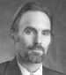

  
Hola,

he leído del asesinato de Steven Vincent, un periodista de los EEUU, a las manos de hombres armados que salían de un coche de policía en la ciudad de Basora, Iraq. Todo indica que tras denunciar la corrupción de la policía de esa ciudad, esta se tomó la justicia por sus manos. Steve Vincent, realizaba desde hace años un trabajo con una mirada crítica y de lucha de la verdad admirable y reconocida por muchos profesionales de su profesión así como otras muchas tantas de diferentes creencias y nacionalidades.

Este último año había iniciado un blog y publicado un libro alrededor de la vida en Iraq tras la ocupación de los EEUU. Os incluyo el link de su blog:

[In the Red Zone](http://spencepublishing.typepad.com/in_the_red_zone/)

Además, aprovechando este artículo os incluyo links a los cuatro períodicos Iraquíes con presencia en la web:

En Árabe:  
[Al Sabaah](http://www.alsabaah.com/)  
[New Sabah](http://www.newsabah.com/)  
[Azzaman](http://www.azzaman.com/)

En Inglés:  
[Azzaman](http://www.azzaman.com/english)