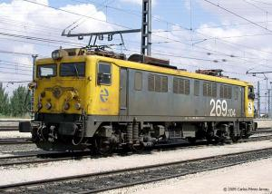
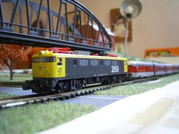
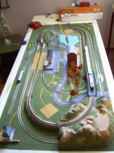
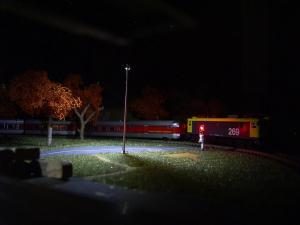
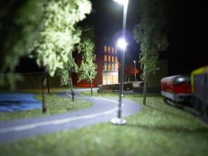
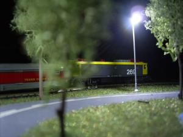
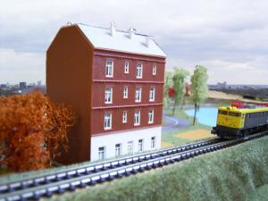
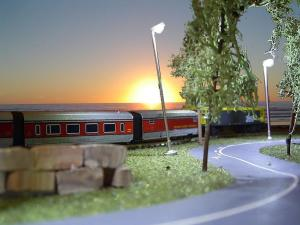

Hola,

Durante este tiempo estival entre otras muchas cosas he recuperado un viejo Ibertren que teníamos en las golfas de casa desde hace años. Le quité el polvo, literalmente, le limpie las vías y me puse dispuesto a provar el tren. Este era un talgo III, con una locomotora Renfe 2000-T, la Virgen del Carmen. Pero su motor estaba quemado, y como la reparación de estos no son nada simples poco podía disfrutar de la maqueta. Problema, sin locomotora no hay tren, y fue en ese momento cuando me aficioné al mundo del modelismo ferroviario:

Primero necesitaba una locomotora y adquirí una Renfe 269 de la marca [Kato](http://www.katomodels.com/). Esta marca japonesa por lo que he descubierto tienen mucha calidad a un precio más asequible. Digo asequible porque 70€ no tienen nada que ver con los 120€ o 200€ o más que cuestan muchas locomotoras nuevas. Además [Kato](http://www.katomodels.com/) tiene un buen surtido de máquinas Renfe en la escala de mi maqueta, la N, cada vez menos usada en contraposición a la H0, por lo que podía escoger una locomotora “familiar”.

Bueno, y ahí está, la 269 tirando del tren Talgo III recordado por ese característico color rojo. ¡Magnífico!

Pero no sólo son trenes el modelismo ferroviario, también es muy importante el escenario reproducido. En mi caso me he basado en el escenario original del Ibertren ( compañía que desapareció hace unos años, pero que acercó a muchas personas este hobby aquí en España ). Este escenario son básicamente dos recorridos circulares, que atraviesan una pequeña montaña, un recorrido a través de un tunel y el otro salvándo la montaña con unas rampas. En medio, una pequeña estación de un pueblecito que es atrevesado por una sinuosa carretera.  
Las ampliaciones realizadas en este sentido han sido varias. He construido árboles, he comprado una casa de servicio ferroviario situado en la esquina inferior izquierda y un bloque de apartamentos ambas de la marca [Faller](http://www.faller.de/), que son de gran calidad y hay que montarlas como maquetas que son :).

  
Además le he añadido algo que años atrás creo que no hubiera sido capaz de hacer, que es luz. Así pues las casas tienen luz interior, hay farolas en la calle y también un cruce en la carretera con sus respectivas luces. Ha sido muy divertido montarlo todo, y me ha servido para refrescar asignaturas de electrónica que realizé en la universidad. Realmente queda bastante espectacular cuando cierras la habitación por completo y no hay otra luz que la que genera la maquesta, y es que además disimula los defectos de esta.

Por cierto, me he permitido el lujo de crear un par de imágenes curiosas con el Photoshop: En primer lugar, un Talgo circulando por los alrededores de Londres subiendo por una rampa. Segundo, otro Talgo circulando por playas de Nueva Zelanda en una puesta de sol.

Os animó a visitar un link, imprescindible para iniciarse en este mundo aquí en España: [Plataforma-n](http://www.plataforma-n.com/). Vale la pena, como mínimo las galerias de fotos de maquetas de gente que si sabe de esto.

Incluyo los enlaces web relacionadas con el modelismo ferroviario más interesantes que he recogido:

Asociaciones:

-   [Agrupament Ferroviari de Barcelona](http://www.xarxabcn.net/agrupament/pmaq5.html), podemos ver diferentes maquetas y obtener más información sobre esta asociación de Barcelona. También hay información sobre el mercadillo de modelismo MercaHobby que se realiza una vez al mes en Barcelona.
-   [N Gauge Society](http://ngaugesociety.com/index.htm), la asociación más famosa de Inglaterra dedicada al modelismo de trenes de escala N. Web impresecindible.

Revistas:  

-   [Railwaymania](http://www.railwaymania.com/default.asp), revista electrónica decicado al mundo de los trenes

Maquetas profesionales:

-   [AlbulaModell](http://www.modell-bahn.ch/), web de una maqueta impresionante y muy profesional suiza. Bestial!
-   [Maqueta F+F](http://www.maquetaff.org/), información de una gran maqueta expuesta cerca de la ciudad de Barcelona

Montaje:  

-   [La Plaza Virtual](http://www.laplazavirtual.com/hobby/), más consejos para construir una maqueta
-   [Ferrokata](http://ferrokata.tk/), interesante web con muchos consejos y pasos a seguir en la relización de un maqueta de trenes

Personales:  

-   [Vicenç Ferrer](http://www.vferrer.net/index.htm), página de quien dicen uno de los mejores modelistas de hoy en día. La web es senzilla, pero los modelos que aparecen son extraordinarios
-   [David Ruso,](http://www.terra.es/personal2/davidruso/web_2.htm) página personal de un forofo del modelismo de trenes
-   [Escala Ene](http://www.galeon.com/escalaene/), web de un aficionado al modelismo, fotos de su maqueta e información muy interesante sobre la desaparecida Ibertren
-   [Treneros](http://webs.demasiado.com/treneros/tren.htm), fotos de una maqueta pequeña pero muy artesanal e interesantes consejos y material para crear rótulos reales de Renfe para estaciones y vías
-   [WebTren](http://webtren.iespana.es/maquetas.htm), una web personal con fotos de su maqueta y otra información interesante

Y nada, esto es todo, yo seguiré poco a poco ampliando este pequeño universo que he creado e iré poniendo posts cuando tenga novedades importantes.

¡Nos vemos!