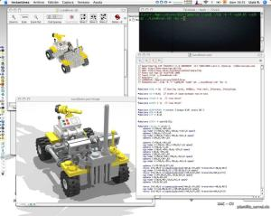

Perdiendo el tiempo por Internet he encontrado un programa muy curioso. Es un constructor [LEGO](http://www.lego.com/eng/Default.aspx) para mi manzana. ¿Quién no conoce el LEGO? A mi me encantaba montar construcciones de pequeño y sobretodo vehículos con un par de piezas y mucha imaginación. Siempre había querido tener una caja mágica con todas las piezas existentes e infinitamente repetidas para montar aquello que quisiera… ¿Un sueño? Sí, pero hecho hoy realidad.

Este programa que os comento se llama [BrickSmith](http://bricksmith.sourceforge.net/) y es un interficie para [Mac OSX](http://www.apple.com/macosx/) de la librería [LDraw](http://www.ldraw.org/). Esta librería contiene todos los diseños de todas las piezas de LEGO, ha sido desarrollada altruistamente por fanáticos voluntarios y está disponible gratuitamente para que se haga uso de ella, como lo hace BrickSmith.

BrickSmith permite escoger tantas piezas como queramos, colocarlas en un espacio virtual, darles el color que deseemos y rotarlas en cualquier sentido. Con estas operaciones podemos crear cualquier cosa: desde una cabina de teléfonos hasta una ciudad entera, eso si, con un poco de paciencia…

Si usáis Windows, podéis probar los siguientes programas parecidos a BrickSmitch: [MLCAD](http://www.lm-software.com/mlcad/) y [LeoCAD](http://www.leocad.org/).

Pero aquí no se acaba la cosa. Estos programas que os estoy comentando, sólo sirven para crear los modelos pero el resultado visual es muy bajo, básicamente porque están pensados para eso, para manipular los modelos y por tanto la calidad gráfica debe ser baja para que el ordenador pueda trabajar de forma fluida. Entonces, ¿Cómo se puede conseguir un resultado lo más cercano a la realidad como si de una foto fuera?

Usando los programas de [Renderización de Imágenes](http://es.wikipedia.org/wiki/Renderizaci%C3%B3n). Estos crean un escenario con luces, cámaras, efectos ambientales y muchas otras cosas con una calidad fotorealista a cambio de usar mucho tiempo de proceso del ordenador. Si todavía no está claro, mirad la captura de pantalla de mi ordenador que hay arriba: un modelo, que es un vehículo lunar. La ventana de arriba corresponde a la aplicación BrickSmith y la de abajo la generada por un renderizador. La diferencia de calidad salta a la vista.

Para los modelos creados con BrickSmith he usado un renderizador de imágenes gratuito y de mucha calidad, el [POV-Ray](http://www.povray.org/). Para ello he necesitado antes una aplicación llamada [l3p](http://www.hassings.dk/l3/l3p.html) que sirve para traducir el modelo generado con BrickSmith a un escenario que POV-Ray sepa interpretar.

Aún sin tener conocimientos de renderización de imágenes (consciente de que quien las tenga puede crear imágenes artificiales que no se diferencian de la realidad) los resultados obtenidos de mis primeros modelos de LEGO con ordenador son bastante interasantes. Como ejemplo el camión bajo una palmera y un avión sobrevolando aguas cristalinas que acompañan estas lineas.

A continuación los links para conocer más a fondo el mundo de LEGO en el ordenador. Ver para creer:

-   [Anton Raves](http://www.antonraves.com/welcome.php), página personal con imágenes y animaciones de una calidad elevadísima de modelos LEGO generados por ordenador. Algunos modelos se pueden bajar y usar.
-   [Digital Bricks](http://www.digitalbricks.nl/), un montón de imágenesmodelos de trenes y otros vehículos terrestres.
-   [BrickVista Models](http://www.magneticpie.com/LEGO/models.html), modelos senzillos que se pueden bajar de vehículos lunares y marcianos. Poco pero de mucha calidad.
-   [LegoAtHome](http://www.legoat.com/defaultAction.do), un gran cantidad de modelos para crear con sus respectivas instrucciones paso a paso
-   [NatePickens](http://www.natepickens.com/index.php?cat=lego&subcat=system&page=main), página con instrucciones para la creación de modelos

Bien, no creo que vaya a poner muchos más post acerca de estas herramientas, ya que absorben una gran cantidad de tiempo usarlas, pero si alguien está interesado ya sabe por donde comenzar.

Aloha!,