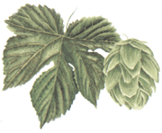

2.2 Ingredientes

Los ingredientes son:

-   Grano, la cerveza puede fabricarse a partir de diferentes granos, como el arroz, el maíz, la cebada, el trigo y la avena. Tal elección dependerá de la zona geográfica y su disponibilidad así como las preferencias del cervecero y las restricciones políticas de la zona. En España, el cereal que define la cerveza es la cebada, que es el grano más común, pero no hay que ir muy lejos para encontrarse cerveza creada a partir del trigo, como es más común en Bélgica.

-   Malta, una vez que el cerverzero ha decidido qué tipo de grano o granos usar, hay que prepararlo. El resultado de esta preparación se le llama Malta y es tan importante como la elección del grano. El proceso es el siguiente, el grano se pone en remojo para que germine. Una vez que ha germinado, se la seca y tuesta: es el malteado obteniendo la malta, base de la cerveza (y también del whisky). Como excepción tenemos, el trigo sin maltear, usado por muchas cervezas belgas, que también proporciona cervezas de gran calidad (mucho cuerpo y sabor). A la cebada se le puede añadir arroz y maíz, que no pueden maltearse. Eso genera cervezas de menor calidad (ligeras de cuerpo y sabor). Muchas cervezas industriales se obtienen de ésta forma, pues el arroz y el maíz son más baratos que la cebada. Cuánto más tiempo se dedique al tueste de la cebada, y cuanto mayor sea la temperatura, más oscura será la cerveza resultante.

-   Agua, Entre el 80 y 90% de una cerveza es agua y por tanto, es un ingrediente muy importante. El agua utilizada para la fabricación de cervezas proviene de pozos, manantiales, ríos y en algunos casos deaguas subterraneas. En general, las aguas duras son ideales para producir ales, pero la blanda es más apropiada para las lagers más ligeras.

-   Lúpulo, Es una planta trepadora que da a la cerveza su aroma y amargor característico. Al mismo tiempo impide que se desarrollen microorganismos, alargando su conservación de una forma natural. Para elaborar la cerveza se usan las flores femeninas del lúpulo. Existen muchas variedades de lúpulo que dan diversos sabores y aromas a las cervezas. Además de lúpulo, pueden añadirse hierbas, especias o frutas, para dar un sabor aún más especial y diferenciador a la cerveza (por ejemplo, añadir anís o naranja).
    
    
    

-   Levadura: No es en si un ingrediente sinó un organismo unicelular que es el encargado de transformar el azúcar en alcohol. La levadura es en realidad la esencia de la cerveza, pero es muy susceptible a la infección y mutuación y es el motivo por el cual el cervezero sólo utiliza un cultivo cada cinco o seis veces.

La mayor parte de cervezas se elaboran con cebada malteada a la que se da sabor con el lúpulo.