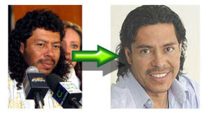

Efectivamente,

es René Higuita, el extranvagante guardamenta colombiano, que tras participar en el concurso [Cambio extremo](http://www.blogger.com/www.canalrcn.com/programas/cambioExtremo/index.php) le quedó ese rostro. No os acordáis como era antes?:  
Ahora ya me creo cualquier cosa de la cirurgía.