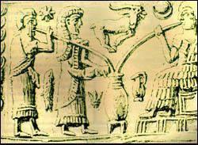
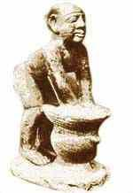

3\. Historia

> “El rayo de sol se hace cerveza  
> al llegar al corazón de la  
> caldera donde se cuece, y la  
> cerveza siembra la poesía en  
> los corazones cuando pasa a la  
> sangre cayendo por la  
> garganta abajo”
> 
> Camilo José Cela

3.1. Historia de la cerveza en el mundo

Orígenes

Numerosos antropólogos aseguran que hace cien mil años el hombre primitivo elaboraba una bebida a base de raíces cereales y frutos silvestres que antes masticaba para desencadenar su fermentación alcohólica; El líquido resultante lo consumía con deleite para relajarse.

Aunque el proceso de fabricación de la cerveza pudiera parecer complejo, lo cierto es que se tienen noticias de la elaboración de una bebida relacionada con ella hace 100.000 años, a base de ciertas raíces, cereales y otras materias ricas en fécula.

Hacia el año 10.000 a.C, con el comienzo del sedentarismo y con el desarrollo de la agricultura,  
en la zona de Oriente Medio, la cebada se empieza a cultivar de forma controlada. Pero aunque fueron los sumerios los que la descubrieron, la cerveza era conocida por todas las civilizaciones anteriores que practicaban la agricultura. En China se han descubierto rastros de una cerveza de arroz de hace más de 4.000 años. Se sabe que existió en Caldea, y la Biblia la menciona en más de una ocasión.

Mesopotamia

Pero los verdaderos impulsores de la cerveza fueron los sumerios (Mesopotamia), hace 6000 años, cuando fabricaban el sikaru (“una bebida obtenida por fermentación de granos”) a base de grano y panes de cebada fermentada. Una tablas de arcilla escritas en sumerio describen la receta para la elaboración de esta bebida:

“Se cuece pan, se deshace en migas, se prepara una mezcla con agua y se consigue una bebida que hace a la gente alegre, extrovertida y feliz”.

De aquella época procede el primer anuncio de cerveza conocido. Se trata de una tabla de arcilla en la que una mujer muestra dos copas de cerveza, figurando la frase: “Bebe cerveza con el corazón del león”. Durante el siglo XVII a.C, el Código de Hammurabi reglamentaba la fabricación y el consumo de la cerveza. Por ejemplo, los taberneros que defraudaban con el precio o con la calidad de la cerveza eran condenados a morir ahogados.

En sus orígenes esta bebida tenía unos fines medicinales y también se usó como ofrenda para los dioses. En Mesopotamia se ofrecía a la diosa de las cosechas (Ninurta) y a la diosa de la cerveza (Ninkasi). El himno que se cantaba a dicha diosa contenía el proceso de la fabricación de la cerveza. Estas costumbres se fueron extendiendo por la Cuenca Mediterránea, más o menos adaptadas a cada una de las religiones imperantes en cada pueblo.

Egipto

Desde Oriente Medio, la cerveza se extiende por los países de la cuenca oriental del Mediterráneo. Los egipcios, recogiendo los métodos sumerios, elaboran una cerveza a la que introducen nuevos ingredientes, como el lúpulo, la malta, y otras plantas (como azafrán, miel, jengibre y comino), dándole un sabor más fresco, aromático y agradable. Los egipcios atribuyeron la invención de la cerveza a Osiris la divinidad relacionada con los cereales. Según la tradición Osiris ofreció cerveza roja a la sanguinaria leona Semjet (enviada por el dios Ra para castigar la rebelión de los humanos), para hacerla creer que se trataba de la sangre de los hombres. Después de unos momentos de embriaguez en que termina con varios humanos (más de los que tenía previsto el dios Ra) se transformó en Hator, la diosa de la danza y de la música.

En Egipto la cerveza era fabricada fundamentalmente por mujeres que aplicaron varias modificaciones a su fabricación. La más importante fue la preparación de la malta, pero también obtuvieron nuevos aromas y tonalidades con la adición de miel, jengibre, licor de dátiles, mandrágora y cominos. Se sabe que los faraones disponían de maestros cerveceros que se encargaban de preparar cervezas especiales para estimular a las tropas en las batallas.

Fue la bebida nacional del Antiguo Egipto y la bebían tanto los esclavos como los príncipes. También se sabe que había dos tipos principales de cerveza. La cerveza “henquet” era floja y dulce y la cerveza “sejepet jenea” de textura y sabor más fuerte. En cuanto a las propiedades generales de tales cervezas hay que decir que, dependiendo del cereal utilizado, los colores oscilaban entre el rojo y el dorado y que era espesa, muy dulce, sin espuma y con gran cantidad de partículas en suspensión, por ello era habitual beberla con unas cánulas que disponían de unos filtros. De estudios de algunos jeroglíficos encontrados en tumbas de faraones se ha deducido que la cerveza se agriaba con bastante frecuencia También se sabe que bebían cerveza tanto los niños como los adultos.

Los seguidores de la diosa Athor calentaban recipientes con cerveza a los pies de su estatua con lo que se vaporaba el alcohol que subía hasta la cabeza poniéndola de buen humor con lo que concedería las peticiones de sus fieles. El líquido sobrante era vendido (cerveza sin alcohol) y el dinero recaudado se empleaba para el mantenimiento del templo.

En un papiro procedente del Antiguo Egipto quedó reflejado, por primera vez, un accidente de tráfico debido al alcohol. Un carruaje choca contra una estatua de la diosa Athor después de que el conductor haya tomado unas cervezas en una taberna, éste fue condenado a ser ahorcado a la puerta de dicho establecimiento hasta que las carroñeras le dejaran en los huesos. Ya por entonces muchos pueblos mediterráneos ofrecían cerveza a los muertos para ayudarles a realizar el último viaje.