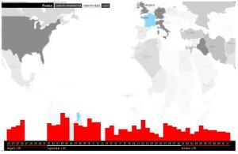

> [“Vanishing Point](http://www.low-fi.org.uk/vanishingpoint/) es otro sistema de visualización de datos basado en proyectar los titulares que generan los medios de comunicación cada día sobre un mapa del mundo. Los paises de colores más oscuros son los que más regularmente aparecen; los de tonos más claros, los que raramente se mencionan. Media Africa es completamente blanca; para la prensa internacional, no ocurre nada digno de contarse en Kazajistán, Mongolia, Bolivia o Paraguay. El sistema se basa en los títulares generados por los periodicos más importantes de las naciones del G7 durante los últimos tres meses.”Vía [Blog ArtFutura05](http://www.artfutura.org/index_blog.php).