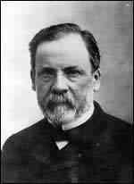

Escocia

En Escocia se cita el consumo de cerveza hacia el año 250 a.C., por partede una tribu llamada los Picts. Al parecer fabricaban cerveza de brezo y se añadía un hongo alucinógeno que crecía junto a dicha planta. El efecto del alucinógeno llegó a provocar tantos problemas entre los miembros de la comunidad que facilitó su conquista por parte de los irlandeses encabezados por el rey Nial.

Griegos y romanos

También los griegos y posteriormente lo romanos fabricaban y consumían cerveza. Los romanos introdujeron la cerveza en Hispania y en otros lugares del imperio, incluida Germania, donde fue muy bien recibida y ampliamente consumida, tanto por los hombres, como por las mujeres, a las que animaba bastante.

Y si entre los romanos y los griegos fue considerada una bebida de la gente llana, los pueblos del norte de Europa festejaron con cerveza sus fiestas familiares, las solemnidades religiosas y los triunfos sobre sus enemigos. La elaboración de cerveza se realizaba de forma casera y  
artesanal.

A principios de la era cristiana, Plino El Viejo relata en su Historia Natural, como los pueblos germánicos construyen los barriles para la cerveza utilizando tablones curvados. Hacia el año 720 existían plantaciones de lúpulo en Baviera y en el año 1079, la abadesa Hildegarde de Saint Ruprechtsberg menciona, en su obra “Física Sagrada”, el poder antibacteriano del lúpulo, al comprobar que las cervezas aromatizadas con él se conservan mejor.

Edad Media

Los métodos de elaboración fueron mejorando con los años, y hasta los monjes y abades se iniciaron en su producción en la Edad Media (cerevisa monacorum), llegando a ser grandes maestros cerveceros que guardaban celosamente los secretos de su elaboración. Se encargaba de dicha tarea el fraile boticario. Los monjes lograron mejorar el aspecto, el sabor y el aroma de la bebida.

El monasterio de Orval, fundado en el siglo XI en Bélgica, sigue produciendo hoy en día cerveza de alta calidad. Ésta y otras cervezas producidas en monasterios trapenses son las únicas que pueden recibir la denominación de origen “trappist”.

Primeras factorías cerveceras

Entre los siglos XIV y XVI surgen las primeras grandes factorías cerveceras en el norte y centro de Europa, entre las que destacan las de Hamburgo y Zirtau. A finales del siglo XV (1516), el Duque de Baviera, Guillermo VI promulga la “Ley de la Pureza de la Cerveza”, en la que se establece que, para su fabricación, sólo se pueden utilizar agua, malta, lúpulo y levadura.

A finales del siglo XVII un químico alemán publica el primer estudio científico (“Zymotechnica fundamentalis”) sobre los procesos de fermentación. En 1680, el científico holandés Anton van Leeuwenhoek observa las células de la levadura en un microscopio.

Hacia 1762 se publica un libro en Inglaterra (“Theory and practice of Brewing”) en el que se explica la utilización del termómetro para la fabricación de la cerveza. Monasterio de Orval, en el corazón de Bélgica donde se sigue fabricando cerveza “trappist”

En una tabla se exponen las temperaturas de tostación de la malta y el color resultante:

-   a los 48°C se obtienen colores claros
-   a 80°C, colores negros
-   a 76°C se obtiene la malta de color café

En 1784 se introducen los sistemas de bombeo con máquinas de vapor para los procesos de elaboración de la cerveza.

La auténtica época dorada de la cerveza comienza a finales del siglo XVIII con la incorporación de la máquina de vapor a la industria cervecera y el descubrimiento de la nueva fórmula de producción en frío, y culmina en el último tercio del siglo XIX, con los hallazgos de Pasteur relativos al proceso de fermentación. En ésta época se desarrolla la producción a gran escala de la cerveza.

Siglo XIX

A principios del siglo XIX se comienza a tomar la cerveza en recipientes vidrio transparente, con lo que se cuidan más algunas propiedades como el color y la transparencia. En 1857, [Louis Pasteur](http://es.wikipedia.org/wiki/Pasteur) publica la obra “Escritos sobre la fermentación láctica” en la que describe los microorganismos que originan los distintos tipos de fermentaciones, tanto las deseables, como las no tan deseables. También describe los modos de separación entre tales microorganismos y propone la destrucción de los dañinos mediante un cerramiento hermético.

Hacia 1860 se implantan los procesos de fabricación en frío que acaban con la limitación de fabricar cerveza sólo en épocas frescas.

A finales del siglo XIX, en EEUU de América, se emprende la fabricación industrial de cervezas de arroz y de trigo que son más estables y ligeras que las de cebada, también tienen menos cuerpo. En ese mismo país, hacia 1873, se comienzan a embotellar las cervezas y se aplica el procedimiento de la pasteurización en unos tanques en los que se introducían las bandejas con las botellas llenas de cerveza y se calentaban con inyectores de vapor, posteriormente se las enfriaba con un chorro de agua fría.