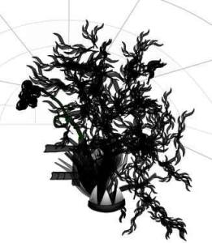
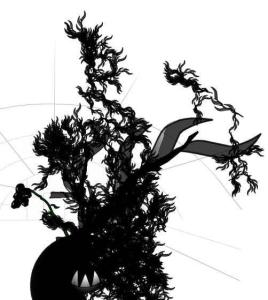

A principios de Agosto os presenté una [página web](http://www.organichtml.com/) que crea una planta a partir de una página web. Por mi parte cree la [planta de mi blog](http://lluisr.blogspot.com/2005/06/mi-planta-blog.html). Ahora ya ha pasado un tiempo, y tal como os comenté, volvería a crear una planta del blog meses después. Lo prometido es deuda:  
Además os incluyo la planta blog de otro blog en el que participo, [estatut05.blogspot.com](http://estatut05.blogspot.com/):