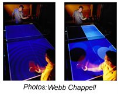

[Hiroshi Ishii](http://web.media.mit.edu/~ishii/) es un profesor de la [Universidad Tecnológica de Masshachusetts](http://www.blogger.com/web.mit.edu), más conocida como MIT. Dentro de ella tiene bajo su responsabilidad el grupo de investigación [Tangible Media Group](http://tangible.media.mit.edu/) que está constantemente inventando formas de interactuar con la tecnología más allá de la omnipresente pantalla e interficie de ventanas.

Este trabajo ha sido expuesto en una de las conferencias del [Art Futura 2005](http://www.artfutura.org/05), y realmente ha sido impresionante y muy bien acogida. Hiroshi ha explicado los trabajos más relevantes dentro en este grupo y que da una idea del mucho trabajo que queda todavía en la interacción del ser humano con las máquinas. A destacar entre los más de treinta proyectos:

-   [I/O Brush](http://tangible.media.mit.edu/projects/iobrush/): una brocha que recoge una textura de un objeto del mundo real y permite posteriormente pintar con la brocha y la textura sobre una pantalla en la pared. ¡Impresionante! ([video](http://web.media.mit.edu/~kimiko/iobrush/iobrush_mpeg_medium.mpg)).
-   [Topobo](http://tangible.media.mit.edu/projects/topobo/): una forma de crear pequeños robots uniendo piezas al estilo Lego y dándoles un movimiento que repetirán como un patrón.
-   [Urb](http://tangible.media.mit.edu/projects/urbansim/): un espacio físico real donde colocar maquetas de edificios a la vez que el ordenador proyecta en tiempo real las sombras en función de la posición del sol deseada.
-   [Ping Pong Plus](http://tangible.media.mit.edu/projects/pingpongplus/): una mesa de Ping Pong que reacciona ante el impacto de la bola con sonidos, música o hasta imágenes sobre la misma mesa.

  

Links:

[Todos los proyectos del Tangible Media Group](http://tangible.media.mit.edu/projects)