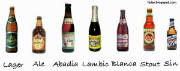

4\. Tipos

  

> “Hay más viejos borrachos que  
> viejos doctores”  
>   
> Anónimo

  

Lager y Pilsen

Rubia y ligera, es la cerveza por excelencia y la más extendida. Se elabora con malta pálida y es de baja fermentación. El contenido alcohólico es la única diferencia entre sus distintos tipos.

Su graduación alcohólica va desde los 3.5 grados hasta los 4 grados. Contiene aproximadamente 45 kcal cada 100 ml.

Ale

Su sabor afrutado proviene de un proceso de fermentación relativamente rápido a altas temperaturas, con variedad de levaduras de fermentación que una vez consumido todos los azucares suben en vez de flocular. Este procedimiento, conocido como alta fermentación, define de manera característica a la cerveza Tipo Ale.

El color y su fuerza varían y hay diferentes tipos: See Bitter, Brown Ale, Cream Ale, Indian Pale, Mild, Pale-Ale, Scotch Ale. Se acerca a las 46 kcal cada 100 ml siendo de 3.5 grados su graduación alcohólica.

Abadía

Se elabora con cebada. Tiene una fermentación alta y una maduración de 2 a 3 semanas como máximo, un mes. Es una cerveza fuerte y artesanal. En la actualidad, este tipo de cerveza se elabora principalmente por monjes de abadías, en Europa. También se produce en pequeñas cervecerías, respetando siempre la producción artesanal.

Su graduación alcohólica es de 4 grados promedio, y su contenido calórico asciende a 55 kcal cada 100 ml debido a su menor contenido de agua.

Gueuze-Lambic  
  

Se prepara con una mezcla de trigo y cebada. Su gran diferencia, lo que la distingue de todas las demás, no sólo reside en los ingredientes sino en la forma de fermentación.

De hecho es la fermentación natural o salvaje lo que la caracteriza, porque fermenta sin necesidad de levadura, ya que ésta se produce naturalmente por fenómenos ambientales. Tiene un fuerte sabor ácido y ninguna efervescencia.

Blanca  

Esta cerveza se hace exclusivamente con trigo. Se llama así porque es muy pálida y de color más claro que la pilsen. De fermentación alta y contenido en alcohol bajo, tiene un sabor ligero pero marcado.

Esta graduada a 3.5 grados y contiene 45 kcal cada 100 ml.

Stout

Casi negra, fabricada con malta tostada con un proceso de alta fermentación. La Stout inglesa es frecuentemente dulce. Normal, Especial y Export. Eleva su contenido calórico a 59 kcal cada 100 ml. mientras que su graduación alcoholica es de 4.5 grados.

Otros tipos

Sake  

El sake es un tipo especial de cerveza originaria de Japón que normalmente se bebe caliente o templada. A menudo se hace referencia al sake, que también se escribe saki, llamándolo, de forma errónea, vino de arroz, debido a su elevado contenido alcohólico. En Japón desempeña un importante papel en actos religiosos y sociales.

El proceso de elaboración de cerveza, que tiene muchos siglos de antigüedad, dura alrededor de seis semanas y comienza con la mezcla y amasado de arroz al vapor, llamado koji, con un moho cultivado y agua. Esta mezcla se calienta y posteriormente se hace fermentar en grandes cubas, a veces en presencia de una levadura. La contaminación del producto se evita añadiéndole ácido láctico. A continuación se filtra.

Kvass

En Rusia una cerveza ligera apenas amarga, llamada Kvass se hace de harina de centeno y malta o de salvado y pan negro y manzanas, lo cual se deja fermentar en agua, y al cual varios otros ingredientes se le agregan. El ácido contenido en el té kvass ruso es primariamente ácido láctico. En hospitales militares rusos, casi todos los pacientes reciben un litro de kvass diariamente, de acuerdo a lo que escribe el Prof. Lindner

Sin alcohol  
  

La elaboración de cerveza sin alcohol se realiza normalmente a partir de una cerveza fermentada y por tanto madurada en su totalidad mediante el uso de la diálisis, conservando así gran parte del sabor.  
