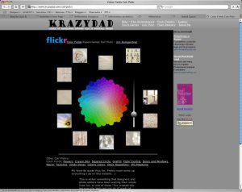
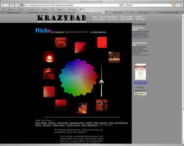

La página web [colrpickr](http://krazydad.com/colrpickr/) permite buscar fotografias en Internet de una forma muy original:

Tan sólo hay que escoger un color de la paleta, y aparecerán fotografias con la misma tonalidad. Haciendo click en ellas podremos verlas al completo.

Se puede definir la temática a buscar, que se realizará sobre las millones de fotos que existen en el [fotoblog](http://es.wikipedia.org/wiki/Fotoblog) del [flickr](http://flickr.com/).

Vía [Information Aesthetics](http://infosthetics.com/)