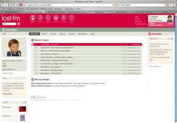

[Last.fm](http://www.last.fm/) es un servicio gratuito muy interesante en Internet. Permite tener un espacio donde guardar estadísticas de las canciones que escuchas en tu ordenador. Se pueden ver cuales son las canciones y álbumes que más has escuchado y obtener información de ellas y de sus autores. Si quieres, también podrás comprar el disco.

  
Pero lo mejor, es que está pensado como un sistema para conocer a gente con gustos musicales a los tuyos. Last.fm te encuentra otros usuarios que escuchan la misma música, te pone en contacto con ellos si quieres, puedes añadir amigos y chatear con ellos.

Para finalizar, es posible sintonizar una radio personalizada en función de la música que escuchas.

Bastante fácil de instalar y sólo hay que escuchar un centenar de canciones para tener la información necesaria para comenzar a sacarle todo el jugo.

Si me queréis añadir en vuestra lista de usuarios: [lluisribes](http://www.last.fm/user/lluisribes)