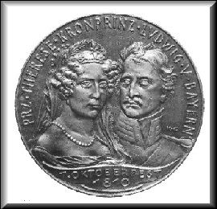
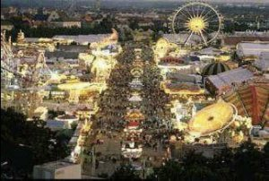
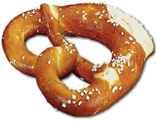

Fiestas en Europa

OKTOBERFEST

La fiesta [Oktoberfest](http://www.oktoberfest.de/) de [Munich](http://www.muenchen.de/) es un acontecimiento histórico que se organizó en 1810 por la primera vez. Durante dos semanas a finales de Septiembre la capital bávara se disfraza de bárbara. El último día de la Oktoberfest siempre es el primer Domingo del mes de Octubre.

Historia de la Oktoberfest

El día 12 de Octubre de 1810 el príncipe Luis, más tarde proclamado rey Luis I., se casó con la princesa Teresa de Sajonia y Hildburghausen. Invitaron a la boda a toda la población de Munich. La fiesta se organizó en un prado en las afueras de la ciudad.

Ese lugar se nombraba [Theresienwiese](http://www.theresienwiese.de/) (Prado de Teresa) en honor de la novia. La fiesta de la boda terminó con una carrera de caballos. Entonces la familia real decidió que aquella carrera debía repetirse cada año, iniciando así la tradición de las Oktoberfeste (fiestas de Octubre). Desde aquellos tiempos la Oktoberfest se ha convertido en la fiesta popular más grande del mundo, recibiendo visitas desde todo el planeta y es conocida por el apodo bávaro muy popular de la fiesta es Wiesn.

¡Bienvenidos al Prado! –Willkommen auf der Wiesn!

Cada año el recinto del Theresienwiese acoge unos seis millones de visitantes, provenientes de todos los países del mundo. A lo largo de las dos semanas se beben unos cinco millones de litros de cerveza, y se comen más de medio millón de pollos asados, 200.000 salchichas de cerdo, quince toneladas de pescado, y unos cien bueyes.

En el terreno del Theresienwiese se encuentran catorce Bierzelte (tiendas de cerveza) enormes con unos 100.000 asientos entre todas. Uno se sienta en bancos plegables y estrechos de madera para consumir la cerveza y comerse una [Brezel](http://de.wikipedia.org/wiki/Brezel) (una especie de rosquilla salada).

A lo largo del día y con las cantidades bebidas, el ruido en las tiendas se hace casi insoportable: hay orquestas en todas las tiendas que tocan los éxitos de la temporada a todo volumen, y la gente canta acompañando la música. Hay cierta clase de versos o refranes estereotipados que se repiten con frecuencia fija, levantándose todos y saltando encima de las mesas: “Oans, zwoa, drei, g’suffa!” (que es bávaro y no quiere decir nada más que ”¡Uno, dos, tres, bebido!”.

(Brezel)

La cerveza de Oktoberfest

La cerveza es algo más fuerte que la regular. Tiene unos 4% de alcohol. Se despacha en jarras de vidrio grandes de una capacidad de un litro, exclusivamente. En bávaro llenas las jarras se llaman [Maß](http://de.wikipedia.org/wiki/Ma%C3%9Fkrug). La cerveza llega a las tiendas en barriles enormes de madera, que se llaman Hirschen (ciervos).

Un buen camarero encargado del barril nunca cierra la canilla. Va sustituyendo las jarras rápidamente en cuanto se llenen. Las camareras (siempre son mujeres) se las llevan a docenas a las mesas, donde las venden al pasar. La cerveza en la Oktoberfest entra muy bien y dentro de las tiendas, con tanta música y baile no se nota los efectos. La prueba de lo dicho se encuentra en las estadísticas de la [Cruz Roja](http://www.cruzroja.es/): cada año, casi 500 personas se tienen que ingresar en hospitales por abuso alcohólico excesivo en la Oktoberfest.