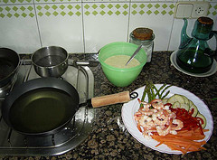
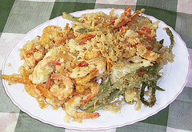

  
([English version](http://lluisr.blogspot.com/2010/05/japanese-tempura-recipe.html) [here](http://lluisr.blogspot.com/2010/05/japanese-tempura-recipe.html))(Este artículo lo dedico a Miho, la profesora que tuvimos en cursos de cocina japonesa en la uni, por compartir sus conocimientos con toda la clase. Gracias.)  
Hola a todos,

hoy voy a publicar un pequeño artículo sobre un plato fácil de hacer y buenísimo, la tempura japonesa, o piezas de comida frita. En parte viene a raíz que el viernes pasado, en una cena con amigos en el restaurante [Hostalet de la Mamasita](http://www.barcelonanocturna.com/restaurantes/lesquinzenits/lesquinzenits.htm) de [Barcelona](http://www.bcn.es/), pedí un plato de este riquísimo manjar, pero lo que trajeron fue tan patético (las verduras tenían un rebozado congelado tipo pescanova de cuando iba al colegio. ¡Esto no es tempura de verduras señores!. Eso sí, en la carta quedaba muy bonito) que no tuve más remedio que el Domingo cocinar tempura para arreglarlo. Así pues, agarré cámara y tomé notas para todos vosotros.Primero de todo, comentaros que pese ser actualmente conocido como un plato de la cocina japonesa, parece que tiene origen europeo, más concretamente de los misioneros portugueses del siglo XVI en Asia. Por tanto no es de extrañar que nos sea familiar y guarda muchas semejanzas con los platos “a la romana”, un plato bastante común de la cocina mediterránea.  
¿Qué se puede cocinar con tempura? Primero y ante todo gambas o langostinos, es esencial. Posteriormente pescado blanco, pulpo, o calamar que está bien bueno, en cuanto a verduras espárragos verdes, pimiento, zanahorias y sus hojas, berenjenas, judías, cebollitas. También, y aprovechando la cocina mediterrania de aquí, se puede hacer tempura con [setas.](http://www.bolets.info/) A mi me gusta especialmente el Fredolic y la seta por excelencia en la cocina japonesa, los [siitakes](http://www.wholehealthmd.com/refshelf/foods_view/1,1523,308,00.html). La razón porque la carne no está incluída en este plato, puede ser histórica, debido que los misioneros la cocinaran en tiempo de cuaresma.  
Es un plato que aunque es fácil de realizar, es muy complejo dominarlo al completo y cada maestro del tempura guarda en secreto las proporciones exactas de harina, agua, huevo, la temperatura del aceite o del agua o el tiempo necesario para freír cada pieza. Es todo un arte.  
Una característica importante de la tempura, es que para saborear la textura y el sabor de las ricas piezas fritas, hay que irlas comiendolas tan pronto como salen del fuego, y sucándolas en la salsa [tentsuyu](http://en.wikipedia.org/wiki/Tentsuyu). Por tanto, quien cocina buena tempura no podrá sentarse con sus comensales.  
¿Y cómo se prepara? A continuación os indico una receta:  
Plato de tempura para 4 personas:

-   1 huevo
-   300 gr. harina
-   300 ml. agua bien fría
-   20 gambas
-   1/2 Pimiento rojo
-   1/2 Berenjena
-   16 Espárragos verdes
-   2 Zanahorias
-   1/2 Nabo
-   Aceite de girasol

Salsa tentsuyu:

-   200 ml. de caldo de atún (Dashinomoto)
-   150 ml. de salsa de soja
-   50 ml. de mirin

(¡Foto Interactiva!):

  
[Preparación Tempura](http://www.flickr.com/photos/lluisr/66465694/)  
Originally uploaded by [lluisr](http://www.flickr.com/people/lluisr/).

Preparación:

1.  Se quita de las gambas la cabeza y la piel dejando sólo la cola. Si son gambas grandes o langostinos, se les quita el nervio central que tienen de color negro. Para ello va bien un palillo de dientes.
2.  A los espárragos quitarles el tallo duro y a las zanahorias, después de pelar la capa superior, cortarlas en rodajas alargadas de 5 a 6 cm de largo. El pimiento trocearlo en trozos alargados y por último, la berenjena cortarla en rodajas finas.
3.  La pasta de tempura, como os he comentado, cada maestro tiene su receta. Una sencilla y bien buena es mezclar primero el agua (¡bien fría!) con el huevo. Luego se le añade la harina y se remueve suavemente, sin mezclarlo demasiado. No importa si queda algún grumo de harina. Queda algo parecido a una horchata espesa.
4.  Preparación de la salsa tentsuyu. Mezclar el caldo de atún, la salsa de soja y el mirin en un cazo y dejarlo hervirlo durante tres minutos. Una vez pasado los tres minutos, dejarla ya preparada en un bol en la mesa y comenzar a cocinar…
5.  Ahora vamos a freír los ingredientes. Poner el [Wok](http://en.wikipedia.org/wiki/Wok) (es la sartén usada en Asia) o un cazo hondo aceite de girasol en abundancia, como una freidora. Si tenéis aceite sólo de oliva lo podéis usar, pero su sabor fuerte hará que no se aprecie el gusto de los ingredientes.
6.  Se espera a que el aceite esté a 170 grados aproximadamente. Para saberlo, dejar caer una gota de pasta de tempura en la sartén, y si baja y vuelve a subir inmediatamente sin tocar fondo, es que está en su justa temperatura.
7.  Se fríe primero las verduras. Se pone las verduras dentro del cazo con la pasta de tempura, se unta bien todas las piezas y se van poniendo de cinco a cinco más o menos en el Wok. Es importante no echar muchas piezas de golpe, porque sinó el aceite se enfría y no sale bien. La cocción es bastante rápida, no hay que freír demasiado pero tampoco la verdura debe quedar fresca.
8.  Posteriormente las piezas de marisco y gambas. Igual que el punto anterior, untarlas bien en la pasta de tempura y poner de cinco en cinco a freír.

Las piezas que se van sacando del Wok rápidamente a la mesa, se unta en la salsa preparada y a disfrutar de esta maravilla.

  
[Tempura](http://www.flickr.com/photos/lluisr/66465695/)  
Originally uploaded by [lluisr](http://www.flickr.com/people/lluisr/).

Un detalle:

-   el aceite que uséis lo podéis reaprovechar para freír otros platos, por tanto no lo lancéis. Guardadlo en un recipiente una vez que se haya enfriado y volverlo a usar.

  
¡Nuevo!:  
Versiones para poder tener la receta disponible en todo momento sin estar conectado a Internet:

-   [Tempura Japonesa: versión PDF completa](http://lluisribes.googlepages.com/TempuraJaponesa.pdf) (pdf/800K): Todos los detalles de la receta con un atractivo formato
-   [Tempura Japonesa: versión PDF ligera](http://lluisribes.googlepages.com/TempuraJaponesaLight.pdf) (pdf/300K): Lo imprescindible, ideal para visualizarlo de forma rápida en en tu teléfono celular, agenda electrónica o iLoQueSea