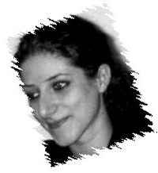

(Este artículo se lo dedico a Ester, una amiga que nos informó de la celebración de los actos alternativos a la cumbre y nos animó a asistir y participar en ellos. Gracias por no cambiar)

Los días 28 y 29 de Noviembre de 2005, se celebró en [Barcelona](http://www.bcn.es/) la [Cumbre Euromediterránea 2005](http://www.euromedbarcelona.org/). Esta cumbre tenía como objetivo el fortalecimiento político de un proceso único de cooperación regional en el Mediterraneo, que se inició en 1995, el [Consorcio Euro-Mediterraneo](http://europa.eu.int/comm/external_relations/euromed/index.htm). Este consorcio busca la creación de una zona de desarrollo sotenible y de paz en la región mediterranea. De esta forma, en su décimo aniversario, se ha realizado una cumbre con los dirigentes (o sus representantes en algunos casos) de los siguientes países e instituciones implicados:

ALEMANIA, ARGELIA, AUSTRIA, AUTORIDAD PALESTINA, BÉLGICA, BULGARIA, CHIPRE, CROACIA, DINAMARCA, EGIPTO,ESLOVAQUI, ESLOVENIA, ESPAÑA, ESTONIA, FINLANDIA, FRANCIA, GRECIA, HUNGRÍA, IRLANDA, ISRAEL, ITALIA, JORDANIA, LETONIA, LÍBANO, LITUANIA, LUXEMBURGO, MALTA, MARRUECOS, PAÍSES BAJOS, POLONIA, PORTUGAL, REINO UNIDO, REPÚBLICA CHECA, RUMANÍA, SIRIA, SUECIA, TÚNEZ, TURQUÍA, COMISIÓN EUROPEA, CONSEJO DE LA UNIÓN EUROPEA, PARLAMENTO EUROPEO, LIGA ÁRABE

El trabajo realizado durante el fin de semana ha sido básicamente la ratificación de los siguientes documentos:

-   [Chairman’s Statement 10th Anniversary Euro-Mediterranean Summit](http://keppard.gridcat.i2cat.net/~lribes/10year.pdf)[,](http://keppard.gridcat.i2cat.net/~lribes/10year.pdf) un resumen de los 10 primeros años de trabajo
-   [Five Year Work Programme](http://keppard.gridcat.i2cat.net/~lribes/FiveYear.pdf), el programa de actuación de los próximos cinco años
-   [Euro-Mediterranea Code of Conduct on Coutering Terrorism](http://keppard.gridcat.i2cat.net/~lribes/CodeConductTerrorism.pdf), una conducta de los paises de la mediterranea frente el terrorismo.

Todo este trabajo se realizó en el Fòrum, una zona de Barcelona, bajo un entorno de seguridad exagerado: carriles de vias rápidas cortados, coches oficiales escoltados por la policía cruzando la ciudad a toda velocidad, paradas de metro anuladas y un cordón policial de seguridad alrededor del Fòrum del que prefiero no saber su coste. Y es que parece ser que muchos gobernantes siguen estando muy lejos de los ciudadanos. En definitiva, mucho ruido y pocas nueces porque los resultados no ha despertado ningún interés en la opinión pública, es más ha habido una sensación de buenas palabras pero poco más con la importante sensación de fracaso que ha conllevado.

Pero algo positivo hay, y es que esta cumbre parece estar abriendo una segunda vía alternativa. Desde hace unos años está naciendo un nuevo movimiento, paralelo y crítico a este consorcio, debido que en los 10 años de existencia parece que no se consiguen resultados significativos. Es más, hay una gran preocupación al entender que las políticas que se están aplicando no están solucionando los problemas de desigualdad, derechos humanos y pobreza sinó que lo único que se está haciendo es mediterráneo preparar la ribera del sur para implantar la política neoliberal en beneficio de los lobbys empresariales y los poderes estatales.

Este movimiento alternativo ya ha creado un congreso paralelo durante el mes de Junio, “[El Fòrum Social del Mediterrani](http://www.fsmed.info/uno-es.htm)” donde habían seminarios, presentaciones y tertulias que exponían otro punto vista muy diferente al presentado por los componentes de la Cumbre Euromediterranea sobre el desarrollo del Mediterráneo. Este mismo movimiento, convocó actuaciones para el fin de semana de la Cumbre, entre ellas una interesante tertulia en el [Centre de Cultura Contemporània de Barcelona](http://www.cccb.org/) (CCCB), y una manifestación el domingo, ambas a las que tuve el previlegio de asistir. Os comento un poco como fué:

La tertulia… “Debat, denuncia i demandes front la cimera de Barcelona +10 al CCCB” quisiera destacar tres intervenciones muy interesantes:

-   Lucile Daumas: activista marroquina que expuso los problemas de la inmigración en el sur de la mediterránea, donde oleadas de personas todavía quieren pasar a Ceuta y Melilla (ciudades españolas) teniendo que cruzar una frontera que ha costado la vida a más de un inmigrante. A este problema se suma la repatriación de los inmigrantes que consiguen llegar a suelo español, que son repatriados a sus países de origen quienes no dudan en dejarlos abandonados en zonas desérticas sin medio alguno. El siguiente artículo resume la intervención realizada: “[Artículo por Lucile Daumas](http://keppard.gridcat.i2cat.net/~lribes/LucileDaumas.pdf)“
-   Faad: palestina de la [Xarxa Palestina](http://www.xarxapalestina.org/) que vive en [Israel](http://www.pmo.gov.il/pmo/) y que dió un testimonio de como Israel está estructurada por y para los sinuistas, de tal forma que si eres practicante de otra confesión religiosa, los derechos que tienes como ciudadano se ven reducidos considerablemente. Adjunto una entrevista relacionado con el problema palestino muy interesante que he encontrado de un colaborador de la Xarxa Palestina que ha vivido en Ramala: [H. Moix, fotógrafo y testigo directo de la vida cotidiana en Ramala](http://www.canalsolidario.org/web/entrevistas/id/?id=76)
-     
    [Nawal Sadawi](http://www.nawalsaadawi.net/index.html): activista y escritora egipcia. Nawal hizo una reflexión alrededor del capitalismo y la clase dirigente de hoy en día que durante décadas está exprimiendo a las clases más desfavorecidas de los países, en especial los del sur, con la complicidad de los regímenes discutibles instaurados en ellos, mediante políticas de comercio, seguridad y asuntos exteriores intervencionistas. Además, se mostró muy crítica con los paises que confiesan con una religión, dado que en estos casos considera que no se puede garantizar la igualdad de derechos a todos sus ciudadanos, por la incompatibilidad entre credos. Para finalizar expuso de forma enérgica y optimista una visión de un mundo mejor, con leyes hechas para los ciudadanos, sin religiones en los gobiernos donde todos somos iguales frente los derechos humanos y la justicia.

… la mani, Domingo mediodía:

-   La manifestación del Domingo al mediodía concentró 6000 personas en el centro de Barcelona. Tras la pancarta “No al Mediterrani del Capital i la Guerra, alternativas a Barcelona +10” 60 organizaciones civiles, políticas y sindicatos así como más gente que se apuntaron recorrieron de forma pacífica y festiva los tres kilómetros que separan la Plaza de Cataluña con la Delegación del Gobierno en el puerto, donde se leyó el [manifiesto](http://keppard.gridcat.i2cat.net/~lribes/Manifiesto.pdf).

[Manifestación alternativa Cumbre Euromediterranea](http://www.flickr.com/photos/lluisr/71604208/)  
Originally uploaded by [lluisr](http://www.flickr.com/people/lluisr/).

Tiempo de reflexión

Este año hemos vivido como Europa se ha estrellado en la ratificación de su Constitución, y ahora esta cumbre, que nuestros gobernanates consideran estratégica pero no parece levantar pasiones. Y es que Europa tiene que cambiar de rumbo y considerar las prioridades sociales con muchísima mayor importancia, más humildad y mayor participación ciudadana (en el Five Year Work Programme hay una mención de ello), pero de verdad. Y este mayor compromiso social pasa por tomar posturas más duras frente gobiernos que toman decisiones unilaterales y totalmente interesadas en contra de la convivencia y los derechos humanos, una postura fuerte como la que se toma ante la lacra del terrorismo. Europa tiene que ser más impecable en la construcción de un territorio donde todos sus ciudadanos puedan vivir en paz, expresarse libremente y crear sus proyectos de vida.

Pero estos cambios sociales en Europa, no los veo reflejados en la clase política, y aún menos en las plataformas de sindicatos, o otras muchas asociaciones que debajo de ideales caducos e inmutables se atan las manos buscando el beneficio para sus ideas y no son capaces de evolucionar hacia las necesidades reales del conjunto de toda la ciudadanía. ¡NO!, el cambio de rumbo debe venir de mano de plataformas ciudadanas multiculturales que impulsen el dialogo, la cooperación y la convivencia en un mundo cada vez más globalizado:

> “Redes de personas interconectadas que compartirán experiencias, recursos, cultura y conocimientos a favor del bienestar de todos”

Y en este fin de semana algo he visto de ello…

más links:  
  
[Observatorio de la Deuda en la Globalización](http://www.debtwatch.org/cast/presentacion/index.php)  
[Ediciones digitales del CCCB](http://www.cccb.org/cat/publi/cata2.htm)  
[Amplio artículo sobre los actos organizados el fin de semana](http://okde.org/provi/barcelona10_dt_291105.htm)  
[Blog Sociedad Pajaril](http://sociedadpajaril.net/aurora/2005/11/25/alternativas-a-barcelona-10/)  
[Enlaces a las instituciones de la Cumbre Euromed](http://www.euromedbarcelona.org/ES/Enlaces/gobiernosPais/)  
[Enlaces a organismos Internacionales de la Cumbre Euromed](http://www.euromedbarcelona.org/ES/Enlaces/OrganismosInternacionales/)