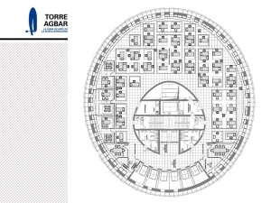
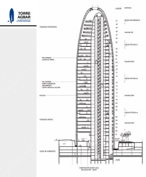

noframes

En relación a un interesante artículo en [Reflexiones Inseguras… y sonoras](http://www.casiseguro.com/2005/12/27/lo-complejo-y-lo-complicado/), quiero complementarlo con un ejemplo concreto. La [Torre AGBAR](http://www.torreagbar.com/), quien su principal promotora es la [agencia municipal del agua](http://www.agbar.es/), es un icono de la nueva [Barcelona](http://www.bcn.es/), una Barcelona que quiere proyectar una “[skyline](http://www.barcelonaskyline.com/)” moderna.

[TorreAgbar](http://www.flickr.com/photos/lluisr/78123056/)  
Originally uploaded by [lluisr](http://www.flickr.com/people/lluisr/).

Pero veamos en que consiste esta proyección moderna, resumidos en tres puntos sobre los que un profesor de arquitectura me hizo reflexionar:

-   Impacto visual
-   El mantenimiento
-   El peligro del fuego

Impacto visual

El edificio, estéticamente, a mi me gusta y mucho, pero reconozco que cuando se ve desde la montaña y en el conjunto de la ciudad, este desentona un poco. Es más, no me quiero imaginar la reacción que tendría [Gaudí](http://es.wikipedia.org/wiki/Antoni_Gaud%C3%AD) si se levantara de su tumba y viera su obra favorita, la [Sagrada Familia](http://www.sagradafamilia.org/), franqueada por este edificio de tan singular forma (considerando el tamaño de ambas obras, están realmente cerca). Pero bueno, sobre gustos no hay nada escrito aunque creo que no hubo un estudio del impacto visual en el entorno de la ciudad.

El mantenimiento  
  
Parece que este edificio está pensado por y para los ojos. Porque a quien le toque limpiar tendrá una faena, y sino mirar el detalle de la fachada en la foto que adjunto:

  
[TorreAgbarDetall](http://www.flickr.com/photos/lluisr/78124658/)  
Originally uploaded by [lluisr](http://www.flickr.com/people/lluisr/).

sus materiales, su disposición, la cantidad de piezas… “[complicado](http://www.casiseguro.com/2005/12/27/lo-complejo-y-lo-complicado/)” ¿no?. Claro, y si no hay buena limpieza no hay buen mantenimiento, y si no hay buen mantenimiento los problemas que puede producir el edificio a lo largo de su vida serán importantes. De momento, ya he encontrado algún toldito de vidrio roto y gente que sabe de limpieza de edificios (aunque solo hace falta tener un poco de sentido común) ya me han hecho el siguiente comentario:

“Limpiar esto debe ser muy difícil y caro”

Peligro de fuego

Si veis los planos que os adjunto, sacados de la [página oficial de la torre](http://www.torreagbar.com/):  
veréis que la planta del edificio se construye alrededor de un cilindro central donde están las escaleras y otros servicios del edificio. Esto permite, que el espacio útil para oficinas sea realmente formidable. Pero tal disposición me recuerda a una chimenea que en el caso de producirse un incendio descontrolado, la acción del fuego puede ser muy peligroso. Además, la curvatura del edificio puede favorecer al tiro avivando el fuego si cabe más. Pero para ello leí que la Torre AGBAR está provisto de expresores por cada metro cuadrado… ¿pero esta es la solución que queremos?

En conclusión, parece que hay mucho arte pero con algunos fallos de diseño funcional bastante graves.

Pero lo que más me preocupa, y es lo que quiero resaltar, es el eslógan de la página web del edificio, un edificio pensado para que la gente trabaje en él:

“Torre Agbar: la obra de arte de la nueva Barcelona”

Desgraciadamente, esto os aseguro que es un reflejo de muchas de las cosas que se hacen urbanísticamente en Barcelona: prima el diseño estético al diseño funcional, y eso no es pensar en los ciudadanos.