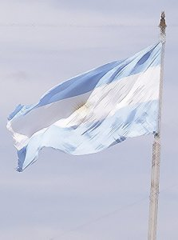

  
Hola,

Voy a iniciar una serie de artículos sobre Argentina tras un pequeño viaje que realicé hace unos días. Primero de todo, quiero dedicar y a la vez agradecer a Julia y Ali, que sin ellas no hubiera hecho este viaje tan lindo, a Marcelo con quien compartí muchas impresiones y opiniones de Argentina y el mundo en general acompañados siempre de un café y una media luna, y a toda su familia que me proporcionaron una estancia muy confortable.

No os voy a dejar un índice, todavía no se de que escribiré, lo haré haciendo tal como me vayan saliendo recuerdos, de momento os dejo una pequeña impresión del país en mi primer artículo. Espero que lo disfrutéis.