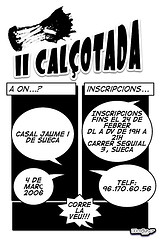

Hola,

unas de mis aficiones es hacer pequeños trabajos gràficos. Esta semana me han encargado hacer unos panfletos de una calçotada que se celebrará en [Sueca](http://es.wikipedia.org/wiki/Sueca), [Valencia](http://es.wikipedia.org/wiki/Comunidad_Valenciana):

y creo que es una buena excusa para explicaros de que va esto.

La calçotada es una fiesta que se celebra durante la primavera en [Cataluña](http://es.wikipedia.org/wiki/Catalu%C3%B1a) principalmente, aunque se ha extendido a otros lugares como [Baleares](http://es.wikipedia.org/wiki/Baleares) y [Valencia](http://es.wikipedia.org/wiki/Comunidad_Valenciana). Se organiza a finales de invierno cuando la sangre comienza a alterarse… Consiste en una comida de calçots, una variedad de cebolla que se cocina a la brasa en grandes cantidades, se va sirviendo en la mesa y los comensales, de pie, agarran uno con la mano, lo pelan para sacar la capa quemada, lo untan en una salsa buenísima llamada [romesco](http://es.wikipedia.org/wiki/Romesco) y todo va para adentro.

El calçot se acompaña con un buen vino en [porrón](http://www.demaisonselections.com/cellar/porron2.htm), unas costillas de carne y butifarras hechas con el mismo fuego y mucha juerga (joda). Se aconseja usar babero grande o delantal, porque acabas con todas las manos llenas de carbonilla, la camisa con romesco por todas partes y si no apuntáis bien el porrón, con vino por todo tu cuerpo…

Así pues, si estáis por Cataluña y tenéis la oportunidad de ir a una calçotada con amigos no dudéis en apuntaros.

Y si estáis en Valencia, os podéis apuntar a la calçotada de Sueca, para más información mirad el dibujo que acompaña el artículo.

Unos links…:

[Calçot – viquipèdia cat](http://ca.wikipedia.org/wiki/Cal%C3%A7ot)  
[Calçot – wikipedia es](http://es.wikipedia.org/wiki/Cal%C3%A7ot)  
[La Calçotada Alt Camp](http://www.altcamp.info/calcotada.htm)  
[La Festa de la Calçotada](http://www.firesifestes.com/Fires/F-Calcotada-Valls.htm)