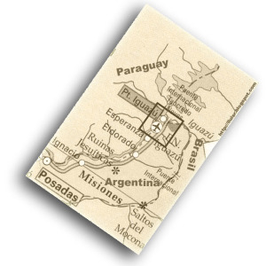
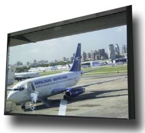
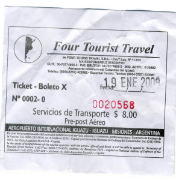
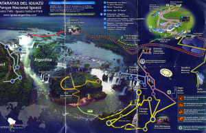

Viajar a las [Cataratas de Iguazú](http://es.wikipedia.org/wiki/Cataratas_del_Iguaz%C3%BA) es casi obligatorio si se visita [Argentina](http://es.wikipedia.org/wiki/Argentina) o [Brasil](http://es.wikipedia.org/wiki/Brasil). Éstas se pueden disfrutar en cualquier época del año, en un par de días o más dado que todo el parque y la región que rodea las cataratas es muy lindo.

Yo estuve tan sólo día y medio, pero no por ello dejé de tener la impresión de haber visto algo único en el mundo.

Las Cataratas de Iguazú se sitúan en el nordeste de Argentina, en la región de [Misiones](http://es.wikipedia.org/wiki/Misiones_%28Argentina%29) y están justo en la frontera con Brasil. Es más, el rio Iguazú, que rompe en caída libre en las cataratas es la frontera de ambos paises durante un largo recorrido. En el mapa siguiente se observa con detalle la zona y las diferentes fronteras, y enmarcado en un cuadro la zona que podéis ver desde el satélite en este [link](http://maps.google.com/?ll=-25.661952,-54.519653&spn=0.306365,0.449753&t=k):

  
Viaje

Para llegar desde Buenos Aires, a unos 1000 km, existen diversas posibilidades. Una de ellas son los micros o buses regulares que salen de noche y están casi todo un día en realizar el recorrido. Estos están muy bien acondicionados ya que puedes pedir un pasaje con cama. El bus es la forma más económica de viajar. La otra forma es mediante un vuelo aéreo. Es una opción más cara pero [Aerolineas Argentinas](http://www.lluisribes.net/www.aerolineas.com.ar/home.asp) vuela regularmente varias veces al día desde el [aeroparque de Jorge Newbery](http://es.wikipedia.org/wiki/Aeroparque_Jorge_Newbery) y es un vuelo de menos de una hora. Olvidaros de trenes, y el coche no es un viaje especialmente interesante.

Si escogéis avión, llegaréis a un pequeño aeropuerto muy bien acondicionado. Me recordó a un aeropuerto de [Lego](http://www.lego.com/) (o de cualquier otro juguete), empotrado entre la selva. Es fenomenal. Una vez allá, se puede agarrar un taxi en el mostrador del aeropuerto, alquilar un coche o agarrar un servicio de microbus de una agencia de viajes que hace el recorrido desde el aeropuerto a cualquier hotel de Puerto Iguazú. Esta opción escogí,  
y tras circular por una carretera que se abría entre la jungla subtropical, llegué hasta la puerta del hotel.

Dormir

Hay muchos lugares para hacer noche, uno de ellos es la opción que escogí, el pueblo [Puerto de Iguazú](http://www.argentinaturistica.com/igziresenia.htm). Este está a 30 km. del [aeropuerto internacional](http://www.aa2000.com.ar/index.php) y a escasamente 20 km del [Parque Nacional](http://www.iguazuargentina.com/) [de Iguazú](http://www.iguazuargentina.com/) y sus cataratas. Es un pueblo muy tranquilo con una gran cantidad de ofertas hoteleras para todos los gustos, desde hoteles baratos hasta resorts de un gran lujo. También existen una gran cantidad de hostales para gente joven y campings muy buenos a las afueras del pueblo. Pese a todo, es recomendable realizar la reserva antes de ir así como conseguir un lugar por medio de una agencia de turismo, para evitar dolores de cabeza.

Los servicios dentro del pueblo cubren todas las necesidades para tener una estancia completa, tiendas, restaurantes, agencias de turismo, banco, central de buses y lo que me sorprendió más, es quizá el pueblo donde he visto más locutorios y cybercafés por metro cuadrado en mi vida. Por tanto no os preocupéis por quedaros incomunicados…

Otra opción muy recomendable es ir a Foz de Iguazú, en Brasil, que se llega cruzando un puente internacional desde Puerto Iguazú. Foz es una ciudad ya más grande y la oferta hotelera es todavía mejor.

Pasaje y acceso al parque

El primer día llegué al mediodia, y como me quedaba todavía toda la tarde, tras un buen baño, aproveché para hacer la primera visita a las cataratas. Para llegar desde Puerto de Iguazú a la Cataratas me dirigí a la central de micros en el centro del pueblo. Allá hay múltiples paradas de turismo, y en muchas de ellas te venden un pasaje de ida y vuelta al Parque Nacional Iguazú con el micro público. Algunos de estos micros son viejas glorias pero funcionan de maravilla y con una frecuencia de paso de media hora durante todo el día.

La entrada al Parque Nacional se compra en el acceso. El precio varía mucho: si eres residente de la zona, la entrada es gratis. Si eres residente de la región tienes un buen descuento. Si resides en el [Mercosur](http://es.wikipedia.org/wiki/Mercosur), todavía tienes un descuentillo y finalmente, en cualquier otro caso debes pagar la entrada completa, de 30 pesos. ¿Adivináis cual pagué?:Como podéis ver en las dos entradas, pagué la de 30 pesos. Eh, la de $15 no significa que de repente un día me hize indígena, sino que si a la salida del primer día te haces sellar la entrada, al día siguiente puedes comprar una entrada a la mitad de precio. Por cierto, dentro del Parque hay de todo, restaurantes, cajeros automáticos, tiendas de revelado digital, souvenirs, guardaropas…

1 día: una tarde

Como os comentaba el primer día sólo tenía la tarde, por tanto fuí directo a ver la famosa [Garganta del Diablo](http://www.flickr.com/photo_zoom.gne?id=93225562&context=set-72057594057078989&size=l). Para ello, sólo hay que agarrar el [tren de gas](http://static.flickr.com/30/98032587_6c9ddf89db_o.jpg) que sale desde la entrada hasta la última estación (20 minutos), caminar por [una pasarela plana que atraviesa parte del rio Iguazú](http://static.flickr.com/17/93225558_8b8eedc01c_b.jpg) (20 minutos más) y se llega al salto más espectacular. El ruido de la caída de tal cantidad de agua es impresionante y es un espectáculo fantástico. Es realmente una garganta diabólica, nada escapa de ella, tiene una fuerza increíble… aunque por un momento, en el video me he imaginado el posible paraiso… las aguas escapando de la garganta…

Y este fue el primer día, y sólo con esto quedas ya alucinando (puedes estar horas delante de las caída que no te aburrirás). La tarde comenzaba a romperse mientras la luz iba atenuándose lentamente. Momento para regresar al pueblo. El día siguiente se presentaba duro y había que descansar.

2 día: completo

Mi segundo día fue más completo y me dediqué a recorrer todos los caminos del lado argentino del parque. El parque es básicamente una inmensa jungla subtropical cruzada por múltiples pasarelas que te llevan a los lugares más pintorescos. Es muy bonito, y a quien le guste caminar disfrutará de verdad. Fue un día muy largo, que os voy a contar… creo que dejaré que lo visitéis vosotros mismos… Clicar sobre el mapa del parque, y accederéis al mapa interactivo donde podréis visualizar las fotos de los lugares más lindos del parques a los que visité:

Consejos  
  

Os dejo unas recomendaciones que a mi me fueron muy bien para visitar todo el parque durante una jornada completa:

1.  Caminar todo lo que se pueda y hacer todos los recorridos. En el Sendero Macuco, llevar agua, es una media hora larga caminando por la jungla hasta el Salto Arrecho, y otra media hora de vuelta.
2.  Llevar ropa de baño así como ropa para cambiarse. Primero porque hay zonas de baño (Isla San Martin y Salto Arrecha) y segundo porque hay unos recorridos con lanchas por las cataratas que te llevan debajo mismo de alguna de ellas. La emoción está garantizada a cambio de un baño completo.
3.  Llevar cámara de fotos (y baterias). Sin comentarios.
4.  Llevar crema anti-mosquitos. En algunos lugares realmente bellos no puedes quedarte si no estás bien protegido.
5.  Sin salirse de los caminos, estar atento a la fauna que los rodea. Puede sorprenderos.

Eso no es todo…

¿Qué os ha parecido? ¿Lindo? Pues bueno, comentaros que me quedó pendiente cuatro cosas, que por falta de tiempo no pude realizar, pero os lo recomiendo si podéis hacerlo:

1.  Visitar la parte de Brasil de las Cataratas. Para ello consultar antes con la recepción del hotel o con vuestra agencia sobre la mejor manera de realizar la excursión, aunque en general, desde Argentina sólo hay que agarrar transporte público que cruce el puente Internacional de Puerto Iguazú, enseñar pasaporte y hacer 20 km más. La vista desde Brasil no es tan brava, pero se tiene una perspectiva mucho más amplia del conjunto de las cataratas, y dicen que:  
    
    > “Argentina es el espectáculo, Brasil el escenario”
    
2.  Visitar el parque en una noche de luna llena. Sencillamente debe ser único.
3.  Visitar el parque en temporada de lluvia. Sí, y es que aunque parezca mentira por la cantidad de agua en las fotos, mi visita la realizé en verano, pero además en un verano especialmente árido. En cambio, en Julio el rio baja muchísimo más fuerte, se producen a veces inundaciones y es la temporada donde se dice que el rio sangra, por el color rojizo de la gran cantidad de sedimentos que arrastra.
4.  Visitar la región de Misiones. Hay mucho que ver…

[Galeria de fotos](http://www.flickr.com/photos/lluisr/sets/72057594057078989/)