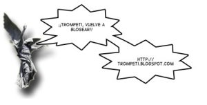

Vicente es un colega que lo conocí en el curro y entre otras muchas virtudes es un tipo con el que se pueden tener grandes conversaciones sobre cualquier tema.

Él se está volviendo a plantear repescar su blog ([trompeti.blogspot.com](http://trompeti.blogspot.com/)), que lo tiene olvidado desde hace muchos meses. Joder, a ver si es verdad :), que el [último artículo en honor a St. Patrick](http://trompeti.blogspot.com/2005/03/my-god-my-guinness-en-honor-st.html) se está evaporando.

Quizá con ayuda divina (aunque creo que le tira más las fuerzas oscuras) se anima y vuelve a subir grandes reflexiones:  
  
Actualización:

… y [trompeti](http://trompeti.blogspot.com/) blogueó el mismo día. 🙂