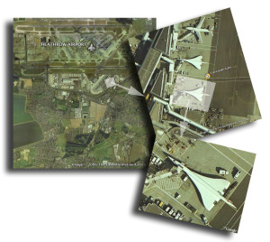

Hola,

hoy me he descargado el soft beta para mi [mac](http://www.apple.com/) del [Google Earth](http://earth.google.com/). Este soft permite visualizar el mundo entero con fotografias satélite. Dependiendo de la zona que estés observando, la resolución o el nivel de detalle es muy grande, podiendo llegar a distinguir los coches perfectamente por poner un ejemplo.

Este post viene a que soy aficionado a los aviones, y mirando por el [aeropuerto de Heathrow](http://www.lluisribes.net/www.heathrowairport.com), en [Londres](http://www.lluisribes.net/www.visitlondon.com) me he topado con dos aviones [Concorde](http://es.wikipedia.org/wiki/Concorde) aparcados en las puertas de embarque de una de las terminales:  
El Concorde ha sido el único avión supersónico comercial de pasajeros (con excepción del ruso [Tu-144](http://es.wikipedia.org/wiki/Tupolev_Tu-144) que no hizo más que 55 vuelos) que ha existido. Era un avión construido conjuntamente por [Inglaterra](http://es.wikipedia.org/wiki/Inglaterra) y [Francia](http://es.wikipedia.org/wiki/Francia) y para que lo comparéis con los aviones actuales, podía llevar 144 pasajeros en un trayecto de 7200km a 2200 km/h y 18,200 metros de altura, cuando un vuelo comercial actualmente los lleva aproximadamente a 930 km/h y a 13000 metros de altura.

Estos increíbles aviones, después de prestar servicio durante 27 años se retiraron en el 2003 y actualmente algunos de ellos se pueden visitar en algunos museos europeos y estadounidenses.

Los links de la wikipedia sobre el avión son muy buenos, encontraréis toda la información que queráis:

[Concorde – wikipedia fr](http://fr.wikipedia.org/wiki/Concorde)  
[Concorde – wikipedia es](http://es.wikipedia.org/wiki/Concorde)  
[Concorde – wikipedia en](http://en.wikipedia.org/wiki/Concorde)