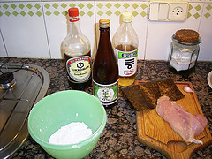
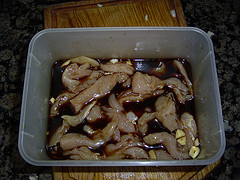
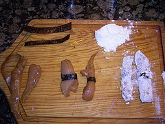
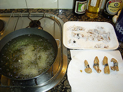
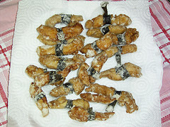

¡De nuevo a la cocina!

En un [artículo anterior](http://lluisr.blogspot.com/2005/11/receta-de-tempura-japonesa.html) os expliqué como hacer un plato de [témpura](http://en.wikipedia.org/wiki/Tempura). Esta vez os presento una receta de elaboración parecido en cuanto se trata también de freír piezas, pero esta vez será el pollo a freír. Esto es el Karaage, pollo frito. Es un plato que requiere tiempo, pero es muy fácil que salga bueno de verdad. Vamos allá:

Plato de karaage para 3/4 personas:

-   2 pechugas de pollo deshuesadas
-   fécula de patata
-   alga nori

Salsa de adobo:

-   3-4 cucharas de salsa soja
-   2 dientes de ajo
-   1 cuchara de mirin
-   2 cucharas de sake

(¡Foto interactiva!):

Preparación:

1.  Se corta el pollo en trozos. Estos trozos que sean en tiras alargadas. Dejar macerar el pollo en un recipiente con la Salsa de adobo durante 30-40 minutos. Cuantos más minutos, más sabor agarrará el pollo de la salsa.
    
    
    
2.  Sacar los trozos de pollo y escurrirlos bien. Envolver cada trozo de pollo con una tira de alga nori y rebozarlos muy bien con la fécula de patata.
    
    
    
3.  Ahora vamos a freír los ingredientes. Poner el [Wok](http://en.wikipedia.org/wiki/Wok) (es la sartén usada en Asia) o un cazo hondo aceite de girasol en abundancia, como una freidora. Si tenéis aceite sólo de oliva lo podéis usar, pero su sabor fuerte hará que no se aprecie el gusto de los ingredientes.
4.  Se espera a que el aceite esté a 170 grados aproximadamente. Para saberlo, dejar caer una gota de pasta de tempura en la sartén, y si baja y vuelve a subir inmediatamente sin tocar fondo, es que está en su justa temperatura.
5.  A continuación se fríen las piezas de pollo. No pongáis muchas de golpe, porque el aceite se puede enfríar y por tanto la fritura no ser óptima.
6.  Cada pieza se fríe durante 3 o 4 minutos, podiendo observar como desaparece el color blanco de la maizena para pasar a color frito rico rico rico.
7.  A medida que se fríen las piezas, ponerlas en un plato, si queréis con papel de cocina para que acabe de absorber el aceite que sobre y hasta que no vaya a la mesa taparlo para evitar que se enfríen.
    
    
    
8.  ¡A comer!

