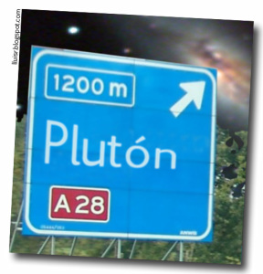

Leyendo el libro “Una breve historia de casi todo“, de [Bill Bryson](http://www.billbrysonbooks.com/), he descubierto un dato que no me he podido resistir a poner en el blog. Es sobre el [sistema solar](http://es.wikipedia.org/wiki/Sistema_solar), y explica que [Plutón](http://es.wikipedia.org/wiki/Plut%C3%B3n_%28planeta%29), el planeta (está en discusión actualmente si se trata de un realmente de un planeta) más lejano al sol está a 5.763.920.000 kilometros de distancia de la [Tierra](http://es.wikipedia.org/wiki/Tierra). Eso hace imposible representarlo en cualquier escala en cualquier libro, y sinó leer este comentario del mismo libro:

> “En un dibujo a escala del sistema solar, con la Tierra reducida al diámetro aproximado de un guisante, \[…\], Plutón \[estaría\], a 2.5 kilómetros – y sería del tamaño similar al de una bacteria”

Así pues, si encontráis un desvío en la autopista hacia Plutón y lo agarráis, recordad antes si le habéis puesto comida al perro…