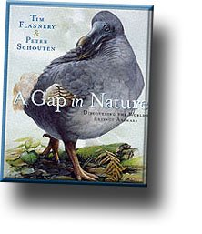

El catálogo más completo con descripciones e ilustraciones de los animales que se han extingido durante estos últimos 300 años lo podéis encontrar en el libro:

[A Gap in Nature](http://www.amazon.com/gp/product/0871137976/102-4728259-8713705?v=glance&n=283155)  
Tim Flannery y Peter Shouten

La crítica que he leído sobre él es excelente, y es una obra que nos aproxima a las barbaridades que el ser humano ha realizado participando activamente y con consciencia a que la gran mayoría de estos animales hayan desaparecido para siempre de este mundo.

Esperemos no aparecer en este libro…