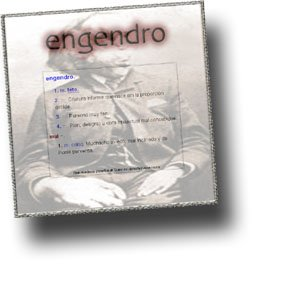

Hola,

[trompetis](http://trompeti.blospot.com/) ha puesto un disco en el curro. Se llama Engendro, y se definen así:

> “Tres músicos de larga y dura trayectoria se unen para dar vida a Engendro. Juan Abarca (Mamá ladilla), Arturo Ballesteros (Castigados sin postre, Camerjazz, Mardú, etc) y Javier Álvarez (Acid rain, Sin Dios) asesinan en serie canciones de ayer y hoy, jalonando el camino de bellos cadáveres. Imprescindible margarita en el culo.”

El disco está disponible en la web [www.engendro.es](http://www.engendro.es/). Incluyo link a sus canciones:

MP3jPLAYLISTS.inline\_0 = \[ { name: "1.- Los Serrano", formats: \["mp3"\], mp3: "aHR0cDovL3d3dy5hY2lkcmFpbndlYi5jb20vdGVtYXMvZW5nZW5kcm8vTG9zX3NlcnJhbm8ubXAz", counterpart:"", artist: "", image: "", imgurl: "" } \]; MP3jPLAYERS\[0\] = { list: MP3jPLAYLISTS.inline\_0, tr:0, type:'single', lstate:'', loop:false, play\_txt:'&nbsp;&nbsp;&nbsp;&nbsp;&nbsp;', pause\_txt:'&nbsp;&nbsp;&nbsp;&nbsp;&nbsp;', pp\_title:'', autoplay:false, download:false, vol:100, height:'' };  

MP3jPLAYLISTS.inline\_1 = \[ { name: "2.- Lidl", formats: \["mp3"\], mp3: "aHR0cDovL3d3dy5hY2lkcmFpbndlYi5jb20vdGVtYXMvZW5nZW5kcm8vTGlkbC5tcDM=", counterpart:"", artist: "", image: "", imgurl: "" } \]; MP3jPLAYERS\[1\] = { list: MP3jPLAYLISTS.inline\_1, tr:0, type:'single', lstate:'', loop:false, play\_txt:'&nbsp;&nbsp;&nbsp;&nbsp;&nbsp;', pause\_txt:'&nbsp;&nbsp;&nbsp;&nbsp;&nbsp;', pp\_title:'', autoplay:false, download:false, vol:100, height:'' };  

MP3jPLAYLISTS.inline\_2 = \[ { name: "3.- No duraría", formats: \["mp3"\], mp3: "aHR0cDovL3d3dy5hY2lkcmFpbndlYi5jb20vdGVtYXMvZW5nZW5kcm8vTm9fZHVyYXJpYS5tcDM=", counterpart:"", artist: "", image: "", imgurl: "" } \]; MP3jPLAYERS\[2\] = { list: MP3jPLAYLISTS.inline\_2, tr:0, type:'single', lstate:'', loop:false, play\_txt:'&nbsp;&nbsp;&nbsp;&nbsp;&nbsp;', pause\_txt:'&nbsp;&nbsp;&nbsp;&nbsp;&nbsp;', pp\_title:'', autoplay:false, download:false, vol:100, height:'' };  

MP3jPLAYLISTS.inline\_3 = \[ { name: "4.- Los estragos del tiempo", formats: \["mp3"\], mp3: "aHR0cDovL3d3dy5hY2lkcmFpbndlYi5jb20vdGVtYXMvZW5nZW5kcm8vTG9zX2VzdHJhZ29zX2RlbF90aWVtcG8ubXAz", counterpart:"", artist: "", image: "", imgurl: "" } \]; MP3jPLAYERS\[3\] = { list: MP3jPLAYLISTS.inline\_3, tr:0, type:'single', lstate:'', loop:false, play\_txt:'&nbsp;&nbsp;&nbsp;&nbsp;&nbsp;', pause\_txt:'&nbsp;&nbsp;&nbsp;&nbsp;&nbsp;', pp\_title:'', autoplay:false, download:false, vol:100, height:'' };  

MP3jPLAYLISTS.inline\_4 = \[ { name: "5.- Lumbares", formats: \["mp3"\], mp3: "aHR0cDovL3d3dy5hY2lkcmFpbndlYi5jb20vdGVtYXMvZW5nZW5kcm8vTHVtYmFyZXMubXAz", counterpart:"", artist: "", image: "", imgurl: "" } \]; MP3jPLAYERS\[4\] = { list: MP3jPLAYLISTS.inline\_4, tr:0, type:'single', lstate:'', loop:false, play\_txt:'&nbsp;&nbsp;&nbsp;&nbsp;&nbsp;', pause\_txt:'&nbsp;&nbsp;&nbsp;&nbsp;&nbsp;', pp\_title:'', autoplay:false, download:false, vol:100, height:'' };  

MP3jPLAYLISTS.inline\_5 = \[ { name: "6.- Vivir sin aires", formats: \["mp3"\], mp3: "aHR0cDovL3d3dy5hY2lkcmFpbndlYi5jb20vdGVtYXMvZW5nZW5kcm8vVml2aXJfc2luX2FpcmVzLm1wMw==", counterpart:"", artist: "", image: "", imgurl: "" } \]; MP3jPLAYERS\[5\] = { list: MP3jPLAYLISTS.inline\_5, tr:0, type:'single', lstate:'', loop:false, play\_txt:'&nbsp;&nbsp;&nbsp;&nbsp;&nbsp;', pause\_txt:'&nbsp;&nbsp;&nbsp;&nbsp;&nbsp;', pp\_title:'', autoplay:false, download:false, vol:100, height:'' };  

MP3jPLAYLISTS.inline\_6 = \[ { name: "7.- Recauchutarme", formats: \["mp3"\], mp3: "aHR0cDovL3d3dy5hY2lkcmFpbndlYi5jb20vdGVtYXMvZW5nZW5kcm8vUmVjYXVjaHV0YXJtZS5tcDM=", counterpart:"", artist: "", image: "", imgurl: "" } \]; MP3jPLAYERS\[6\] = { list: MP3jPLAYLISTS.inline\_6, tr:0, type:'single', lstate:'', loop:false, play\_txt:'&nbsp;&nbsp;&nbsp;&nbsp;&nbsp;', pause\_txt:'&nbsp;&nbsp;&nbsp;&nbsp;&nbsp;', pp\_title:'', autoplay:false, download:false, vol:100, height:'' };  

MP3jPLAYLISTS.inline\_7 = \[ { name: "8.- Soñé que era un pez", formats: \["mp3"\], mp3: "aHR0cDovL3d3dy5hY2lkcmFpbndlYi5jb20vdGVtYXMvZW5nZW5kcm8vU29uZV9xdWVfZXJhX3VuX3Blei5tcDM=", counterpart:"", artist: "", image: "", imgurl: "" } \]; MP3jPLAYERS\[7\] = { list: MP3jPLAYLISTS.inline\_7, tr:0, type:'single', lstate:'', loop:false, play\_txt:'&nbsp;&nbsp;&nbsp;&nbsp;&nbsp;', pause\_txt:'&nbsp;&nbsp;&nbsp;&nbsp;&nbsp;', pp\_title:'', autoplay:false, download:false, vol:100, height:'' };

Recomendable 🙂