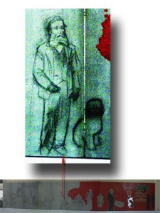

Hacía tiempo que no iba a comer al comedor de la facultad de Física y Química de la [Universidad de Barcelona](http://www.lluisribes.net/www.uab.es). Es un buen restaurante self-service a un excelente precio.

Ayer, me encontré con un mural que están haciendo en la entrada con los científicos más célebres de sus carreras y no he sabido reconocer al personaje que está acompañado por un perro.  
  
¿Qué famoso químico o físico es? Tan sólo sé que se sitúa en una época que se comprende entre la de [Franklin](http://es.wikipedia.org/wiki/Benjamin_Franklin) (a su izquierda) y [Mendeleyev](http://es.wikipedia.org/wiki/Mendeleiev) (a su derecha).