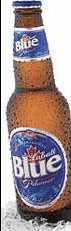

Canadá

Los treinta millones de habitantes no son grandes bebedores de cerveza, con un consumo medio anual de sesenta y cinco litros por persona. Sus gustos se reparten en su gran mayoría en cervezas de producción estatal con algunas exportaciones de Estados Unidos y Europa, así como cada vez más surgen con más fuerza las microcerverías.

La evolución de la cerveza en este gran país comenzó estableciéndose al principio la con las tradiciones de los inmigrantes británicos, pero poco a poco el mercado fue prácticamente de las lagers. Hubo un período de ley seca, pero no en todo el país sino en algunos estados, lo que propició que a lo largo del tiempo se impusieran los gigantes productores nacionales de cerveza [Labatt](http://www.labatt.com/) y [Molson](http://www.molson.com/).

La cerveza más vendida en Canadá es [Labatt Blue](http://www.labattblue.com/), cuyo nombre se deriva del color de su etiqueta. Es producida por [Labatt Breweries of Canadá](http://www.labatt.com/), una cervecera con más de 150 años de historia y que cuenta con más de 3800 empleados. Labatt es miembro de [InBev](http://www.inbev.com/). Labatt también vende y comercializa más de 50 marcas diferentes alrededor del mundo.

Canadá también es la sede de [Molson](http://www.molson.com/), fundada en 1786 y que es la cervecera más grande de Canadá y una de las más grandes del mundo con operaciones en Canadá, Brasil y los Estados  
Unidos. Es la productora de la cerveza más antigua de Norte América, [Carling](http://www.carling.com/).

Estados Unidos

Estados Unidos es el segundo mercado del mundo, por detrás de China, y tiene un consumo per cápita de 86 litros de cerveza al año. El mercado de la cerveza “light” es muy importante y representa un 44 por ciento de las bebidas de malta consumidas en este país. [Bud Light](http://www.budlight.com/) ha destronado recientemente a su hermana mayor [Budweiser](http://www.budweiser.com/) como la cerveza más vendida a nivel local, aunque [Budweiser](http://www.buweiser.com/) sigue siendo la más vendida a nivel mundial. El mercado está dominado por las cervezas tipo lager y un pequeño número de grandes marcas locales.