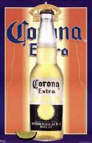

Méjico

Limitando con lo Estados Unidos, Méjico con sus población de más de noventa millones de habitantes, tienen una cultura totalmente diferente a su vecino pero sorprende que sus cervezas se parecen más a las lagers alemanas o también a las lagers al estilo vienes tradicional.

La marca por excelencia popular cerveza es producida por el grupo mexicano Modelo, establecido formalmente en 1991 pero que deriva de la [Cervecería Modelo S.A.](http://www.gmodelo.com.mx/) fundada en el año 1922.

Actualmente [Anheuser Busch](http://www.anheuser-busch.com/) es dueña del 50% de este grupo. La cerveza más consumida, y ya no solo a nivel local, es [Corona Extra](http://www.gmodelo.com.mx/marcas/corona.html). Corona Extra es la cerveza mexicana de mayor venta en el mundo y la cuarta marca de mayor distribución mundial desde 2001. Su origen se remonta al año 1925 cuando esta cerveza de tipo pilsener comenzó a producirse en las instalaciones de la Cervecería Modelo, ubicadas en la Ciudad de México. Hoy en día Corona Extra se exporta a más de 150 países en los cinco continentes.