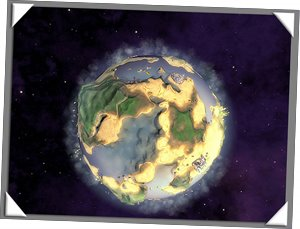

¿Queréis [más juegos innovadores](http://lluisr.blogspot.com/2006/02/guitar-hero.html)? Esperad al nuevo trabajo de [Maxis](http://www.maxis.com/), la creadora de juegos como [Sim City](http://simcity.ea.com/) o [Los Sims](http://thesims.ea.com/). Se llama [Spore](http://www.spore.com/) y está disponible un video de 30 minutos para que podáis ver que maravilla se está cocinando en los laboratorios [de la histórica Maxis](http://www.maxis.com/about/about_timeline1.php).

¿De que va? Pues trata de la vida. Así es, pero no de nuestra ridícula vida de los seres humanos que apenas sobrevivimos 100 años en un mundo que lleva ya millones de años viviendo:

El juego comenzará con el control de un ser simple, primitivo, muy probablemente acuático que lo tendremos que hacer evolucionar, enseñarle a sobrevivir, a reproducirse y volver a evolucionar para que sobreviva y se reproduzca… y lo que era un animal primitivo se convertirá en un animal más complejo que podrá conquistar nuevos hábitas como la tierra, a la vez que su capacidad de conocimiento de la realidad se desarrollará creando vínculos sociales los cuales necesitarán de técnicas conjuntas y herramientas para seguir su evolución, evolución que les llevará a enfrentarse entre diferentes sociedades con armas más complejas para luego, quizá un día, poder abandonar su planeta natal (destruírlo si quieren), navegar por el sistema solar encontrando nuevos planetas para colonizar o engendrar una nueva especie primitiva que la tendremos que hacer evolucionar, enseñarle a sobrevivir, a reproducirse…

Y así hasta que nos cansemos. Si este juego consigue que los caminos a escoger dentro de la evolución sean casi infinitos y eviten un desarrollo lineal, estamos ante la nueva maravilla.

De momento, podéis disfrutar con el video:

  

\[via [BoingBoing](http://boingboing.net/)\]