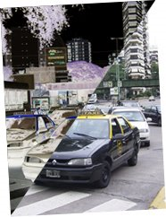

Hay dos tipos de taxis en [Buenos Aires](http://www.lluisribes.net/en.wikipedia.org/wiki/Buenos_Aires%20-):

Los Seguros pero Inseguros y los Inseguros pero Seguros.

Los Seguros pero Inseguros son los remises o taxis de compañías que llamas por teléfono y te vienen a buscar. Estos son seguros, porque sabes que son de confianza y tienen los papeles en regla y no van a hacerte nada malo. Pero te puede tocar un taxi tan atrotinado, que hasta un [gato](http://es.wikipedia.org/wiki/Imagen:Cat02.jpg) que atraviese la calle e impacte con el taxi, podría desmontar completamente el taxi con las malas consecuencias para tu físico.

Por otro lado, los Inseguros pero Seguros, son aquellos que agarras por la calle levantando la mano. Es inseguro porque nadie te garantiza quien te va a llevar, si tiene autorización y no va a pasar nada. Pero son seguros, porque puedes agarrar un taxi moderno, con su cinturón trasero, sin las lunetas rotas y con los asientos enteros.

Moraleja, pedir un taxi en [Buenos Aires](http://www.lluisribes.net/en.wikipedia.org/wiki/Buenos_Aires%20-) es siempre una aventura, si bien lo usé muy a menudo (de los dos tipos) sin problema alguno.

Aún así un par de consejos, evitar agarrar taxis del segundo tipo de noche así como a la salida de centros comerciales, y aprovechar para entablar una interesante conversión sobre política y fútbol, será un viaje más ameno.

Os dejo un par de números de teléfono para pedir taxis del primer tipo:

Remises Porteña: 4566-5777  
Remises Llamenos: 4556-6666

nunca va mal llevarlos encima estos números.