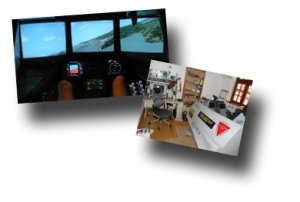

Si te gusta los simuladores aviones, tienes 12000 euros y mucho tiempo puedes montarte una cabina de avión como la de [Hans-Joerg Kronh.](http://hanskrohn.com/)

Hans-Joerg es un serbio que ha ido montando en su habitación una cabina de avión para poder jugar a simuladores de vuelo con algo más de realismo…

[Su página web](http://hanskrohn.com/) es completísima y explica con mucha precisión como lo ha montado. Os doy algunas cifras: 3 pantallas TFT de 21, 5 pantallas TFT auxiliares, 8 ordenadores, una licencia de FS2004 y un montón de bricolaje.