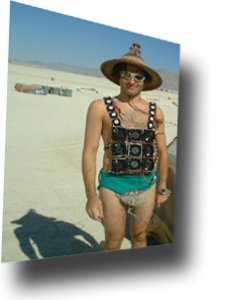

[Mikey Sklar](http://www.electric-clothing.com/bio.html) es vice presidente de un grupo de computación avanzada dedicado a dar servicio al mundo de la banca. Pero a la vez comparte su profesión con una gran afición, nada más que la de crear ropa electrónica. Ha creado muchas prendas diferentes, con sensores, leds o fibra óptica, pero a mi la que más me gusta es la [camiseta ventiladora](http://www.electric-clothing.com/fanshirt.html), ideal para el paseo en un día caluroso. En su página web [Electric-clothing](http://www.electric-clothing.com/) encontraréis toda la información sobre su hobby.