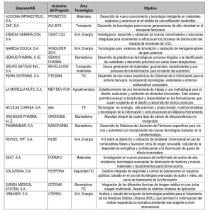

Se ha realizado la adjudicación de los projectos ganadores del [Programa CÉNIT](http://www.red.es/prensa/notas/marzo_06/06_03_22_cenit.html). Este programa del [Estado Español](http://es.wikipedia.org/Espa%C3%83%C2%B1a) destina 200 millones de euros a 16 grandes proyectos en áreas tecnológicas y estratégicas con proyección internacional.

Estos proyectos tienen una duración de cuatro años y participan tanto entidades privadas como públicas.

Este año preparé y organizé la participación del grupo de investigación GridCAT de la [Fundación i2CAT](http://www.i2cat.net/) y del [22@](http://www.bcn.es/22@bcn) en uno de los proyectos que se presentaba (el TESEO) que finalmente no ha estado entre las seleccionadas. Me sabe mal, detrás de este proyecto había muchas horas de trabajo y muy buenos grupos de trabajo aunque creo que al final no se ha sabido reflejar una unidad de todos y parecía un poco un [tuti fruti](http://en.wikipedia.org/wiki/Tutti_frutti) de ideas de cada grupo.

Os dejo los 16 proyectos ganadores de este año por si os pica la curiosidad:

