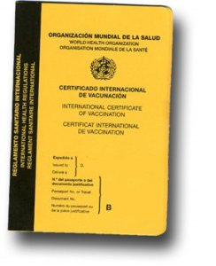

Durante los próximos días colgaré artículos de la visita a Rio que realicé en el viaje a Argentina, espero que os sea de utilidad y os agrade, pero ante todo comentaros que [Rio de Janeiro](http://es.wikipedia.org/wiki/R%C3%ADo_de_Janeiro_%28ciudad%29) es sencillamente sorprendente una ciudad llena de vida, color, música y luz.

El viaje

Para viajar desde [Buenos Aires](http://es.wikipedia.org/wiki/Buenos_Aires) a Rio la mejor forma es mediante avión principalmente por la distancia: 3000 km. Hay muchas compañías que hacen este vuelo pero quizá la más usada es [GOL](http://www.voegol.com.br/) que tiene aires de [EasyJet](http://www.easyjet.com/). Gol es muy famosa en latinoamerica porque tiene billetes económicos hacia [Brasil](http://es.wikipedia.org/wiki/Brasil), aunque acabo de mirar los precios y no me lo parece tanto. En mi caso escogí fue [Varig](http://www.varig.com/), la compañía aérea de Brasil. Está bien y puedes comprar billetes electrónicos, de tal forma que te evita ir a una agencia de viajes a que te impriman el billete.

Los otros medios de transporte, como podéis imaginar son ya viajes en si. Por carretera es espectacular, toda la costa de Brasil es increíble y puedes desviarte hacia la [selva amazónica](http://es.wikipedia.org/wiki/Selva_Amaz%C3%B3nica). Ahora bien, informaros muy bien y tomar precauciones, los asaltos a coches y a familias, sin ser algo muy común, son una realidad y pueden ser muy peligrosos.

Otra opción es ir en tren. La única referencia que tengo es que no hay un viaje directo y por tanto hay que programar diferentes transbordos con lineas ferroviarias distintas. Este viaje puede hacerse un poco largo, y en época de verano me imagino que las condiciones en el tren no son las más cómodas para un viaje de placer pero si para una gran aventura.

Buses y barcos, otras opciones pero de las que no tengo referencia alguna.

En cualquier caso, antes de viajar para Brasil y sobretodo si tenéis pensado alejaros de la costa para adentraros en la selva, consultar vuestra cartilla de vacunación, Brasil es un país de riesgo de algunas enfermedades que se pueden evitar.

Bien, volvamos a nuestro avión de Varig. Lo agarré a las 1800 horas en [el aeropuerto de Etzeiza](http://www.aa2000.com.ar/). Es un vuelo agradable que va siguiendo la costa uruguaya y brasilera durante gran parte del trayecto.

Al [aeropuerto internacional de Rio, el Galeão – Antonio Carlos Jobim](http://www.guiamundialdeaeropuertos.com/airport/airport_guide.ehtml?o=405&NAV_guide_class=AirportGuide&NAV_Airport=405), llegué a las 2100 horas y en el descenso vi uno de los paisajes más impresionantes que jamás he visto: volar la metrópoli de Rio a escasos metros de altura. Una metrópoli que está incrustada entre costa y montañas, con multitud de salidas y entradas de mar, llena de luces que se encienden y se apagan que provienen de carreteras, rascacielos y fabelas, luces que no logras ver el fin de estas, es INCREÍBLE. Es una película de ciencia ficción.

Pero allá se acabo la película, de ciencia ficción. Tras los trámites de aduana en el aeropuerto, los 6 cajeros automáticos (en la segunda planta) no funcionaban y las casas de cambio de moneda estaban cerradas. ¿Cómo agarraba un taxi (el único servicio disponible a esas horas) para dirigirse al centro de la ciudad?

Por suerte llevaba a [Sant George Washington](http://es.wikipedia.org/wiki/D%C3%B3lar_estadounidense) en la cartera y pude pagar con dolares el taxi. Estos están a la salida de la terminal (los taxis ;-)), son de color amarillo y están bien identificados. Ahora bien, si pagas en dólares debes negociar el precio. Yo pagué 20 dólares, es un precio caro, casi el doble del precio real pero dada las circustancias…

En resumen, para evitaros problemas en el aeropuerto de Rio, os recomiendo:

-   llegar a horas más tempranas y cambiar dinero en las oficinas
-   en el aeropuerto de origen, mirar si se puede ya cambiar moneda para llegar a Brasil con Reales (hasta hace poco era imposible)
-   llevar unos cuantos dólares encima

En el caso que lleguéis de día, hay un servicio de ommnibús que lleva hasta el centro de la ciudad, recomendable si váis ligeros de equipaje y queréis tener ya un contacto directo con la realidad de Brasil. Creo que se agarra saliendo de la terminal bajando la rampa. Ahora bien, preguntad antes donde está exactamente la parada, que sinó llegaréis a lugares feos.

Pues allá estaba, dirigiéndome a [Copacabana](http://www.thisisthelife.com/es/new-year-party/copacabana-beach.htm) donde tenía el hotel y saltándome una de las recomendaciones de mi consulado: no viajar de noche por la carretera que va hasta la ciudad por el peligro de asalto. En realidad, en ningún momento tuve sensación de inseguridad dentro del taxi, la carretera es de varios carriles, iluminada y a esas horas muy fluída si bien el taxista circulaba a toda pastilla y hacía cedas de paso en diversos semáforos rojos de las afueras del centro (me imagino por seguridad).

En 20 minutos, estaba ya en el centro de Rio…

