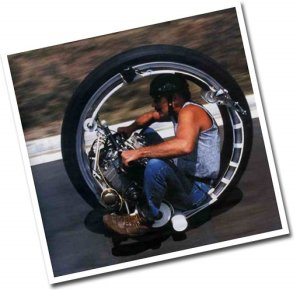

Creía que las [motos de una rueda](http://en.wikipedia.org/wiki/Monowheel) sólo existían en los dibujos manga. Pero no, son bien reales y [Kerry McLean](http://kerrymclean.com/) desde hace 30 años ha perfeccionado esta máquina.

Pero mayor sopresa la mía cuando investigando un poco más, en el siglo XIX ya existían los primeros prototipos: [Historia de la moto de una rueda.](http://www.dself.dsl.pipex.com/MUSEUM/TRANSPORT/motorwhl/motorwhl.htm)

Para más información: [monociclos.com – ¿Monociclo motorizado?](http://www.monociclos.com/nuke74/modules.php?name=News&file=article&sid=26)