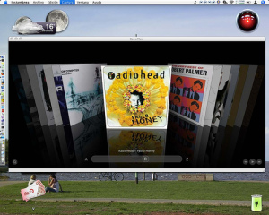

[CoverFlow](http://www.steelskies.com/coverflow/) es un programa para [Mac](http://www.apple.com/) espectacular. Permite interactuar con tu biblioteca de iTunes como si estuvieras delante de tu estantería de CD de música. Puedes ver tus álbumes y navegar por ellos moviéndote con el ratón, así como hacer una búsqueda rápida. Y cuando hayas encontrado el CD que te apezca oír, tan solo clicka en él e iTunes hará sonar el disco.

Unos gráficos efectivos con una interfície sencilla hará las delicias de todo aficionado a la música que disfrutaba buscando su música entre las pilas de CD de su casa.

