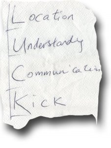

Edward, tras una excursión al [Montseny](http://www.diba.es/parcsn/parcs/index.asp?parc=3) y entre unas cervezas nos explicó el verdadero significado de [LUCK](http://en.wikipedia.org/wiki/Luck) (suerte) en una servilleta…

LUCK es:

-   Location, estar en el momento adecuado
-   Understandy, conocer las reglas de juego
-   Communication, establecer y motivar los contactos necesarios
-   Kick, disparar para dar con la oportunidad