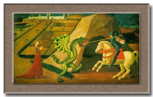

Mañana, 23 de abril, es [San Jorge](http://es.wikipedia.org/wiki/Sant_Jordi).

> “En los alrededores de la ciudad de Montblanc existía un dragón feroz y temible, que tenía la facultad de caminar, volar, y nadar y que tenía un aliento putrefacto, hasta tal punto que desde muy lejos con su aliento envenenava el aire, produciendo la muerte de todos aquellos que lo respiraban. Era la pesadilla del ganado y las personas con las que saciaba su hambre reinando por aquellas tierras el terror más profundo.
> 
> Los habitantes entonces, pensaron en darle cada día una persona que le serviera de presa, a cambio de resguardarse en una cueva donde no pudiera causar daño alguno. El dragón aceptó, pero era difícil encontrar cada día una persona que se dejara comer por el terrible dragón. De esta forma decidieron hacer un sorteo entre todos los habitantes de la ciudad y que fuera la suerte quien decidiera el manjar diario del monstruo. Así se hizo durante mucho tiempo, y el dragón se sentía satisfecho hasta que un día… la suerte quiso que la bella princesa fuera la destinada.
> 
> Ciudadanos se ofrecieron voluntarios para substituirla, pero el rey fue severo, y con el corazón lleno de dolor, dijo que tanto era su hija como la de cualquier súbdito suyo y aceptó sacrificarla. La doncella salió de la ciudad y toda sola se encaminava hacia la cueva del dragón, mientras todos los vecinos, desconsolados y tristes, miraban desde la muralla como se dirigía al sacrificio.
> 
> Pero fue tal el caso, que cuando estaba cerca de la guarida del dragón, se le presentó un joven caballero llamado Jordi, cabalcando en un caballo blanco, y con una armadura dorada y brillante. La doncella, toda preocupada, le dijo que se marchara rápidamente, porque allá rondaba un dragón que así que le viera se lo comería. El caballero le dijo que no temiera, que no le pasaría nada, ni a él ni a ella, ya que había venido expresamente a combatir con el dragón y así liberarle del sacrificio de la princesa, así como de la ciudad de Montblanc. De repente, la bestia salió de su oscura cueva a devorar a la joven princesa, pero antes que este la alcanzara el caballero le dió muerte con su lanza. Entonces, de la sangre vertida por el dragón brotó un rosal de rosas rojas del cual el caballero agarró una y se la ofreció a la princesa como prueba de amor.”

Esta leyenda catalana se basa en la figura de [San Jorge](http://es.wikipedia.org/wiki/Sant_Jordi) que es patrón de [Cataluña](http://www.lluisribes.net/es.wikipedia.org/wiki/Catalu%C3%83%C2%B1a) y [Aragón](http://es.wikipedia.org/wiki/Aragon), pero también de otros lugares como [Portugal](http://es.wikipedia.org/wiki/Portugal), [Génova](http://es.wikipedia.org/wiki/G%C3%83%C2%A9nova), [Inglaterra](http://es.wikipedia.org/wiki/Inglaterra), o hasta [Etiopía](http://es.wikipedia.org/wiki/Etiop%C3%83%C2%ADa). Es un santo caballero de la [Capadocia](http://es.wikipedia.org/wiki/Capadocia) que se convertió al cristianismo abandonando su carrera de soldado. Por no abandonar sus creencias religiosas fue martirizado y decapitado el 23 de abril en el año 303.

Aquí en Cataluña se celebra muy festivamente este día en la “Diada de Sant Jordi” desde hace siglos. El hombre le regala a su querida una rosa roja, señal de pasión, una espiga de trigo, señal de fecundidad y la [senyera](http://en.wikipedia.org/wiki/Senyera), señal de su tierra.

Pero otras celebraciones acontecen en esta fecha. En 1995, la [Unesco](http://www.unesco.org/) instituye el 23 de abril como “[Día Mundial del Libro y de los Derechos de Autor](http://portal.unesco.org/es/ev.php-URL_ID=11144&URL_DO=DO_TOPIC&URL_SECTION=201.html)“. Recordemos que en esta fecha murieron escritores como [Josep Pla](http://fundaciojoseppla.net/content/view/19/49/), [Miguel de Cervantes](http://es.wikipedia.org/wiki/Miguel_de_Cervantes) y [William Shakespeare](http://en.wikipedia.org/wiki/William_Shakespeare).

Así pues, juntamente con la rosa que el enamorado regala a la enamorada, desde hace algunos años ella le regala un libro.

Pero el 23 de abril va más allá de los enamorados y este día ha evolucionado hacia un día de la expresión del amor en el amplio término de la palabra. De esta forma no sólo se regalan rosas a la pareja sinó a todo aquel a quien se aprecia y se regalan libros no solo a él sino también a ella.

En las ciudades catalanas, ya puede llover como hacer sol, ser un día festivo o no (Sant Jordi no es fiesta en el calendario lectivo) que las calles se llenan de gente que salen a pasear junto sus seres queridos en una marea de rosas y libros que están presentes en todos los quioscos y paradas.

Destacar la [ciudad de Montblanc](http://www.montblancmedieval.org/niv2.php?id=35) donde realizan celebraciones medievales para estas fechas y entre ellas la representación de la leyenda del dragón en las mismas calles de la ciudad.

Enlaces de interés:

[Envía un mensaje para la Diada](http://www.senyal.com/santjordi/esp/santjordi.htm)  
[La leyenda de San Jorge](http://www.terra.es/personal/angerod/jorge2.htm)  
[Rafavelarte – Sant Jordi](http://rafavelarte.blogcindario.com/2006/04/00021-sant-jordi.html)  
[Festes de Primavera](http://www.festes.org/primavera/santjordi/)