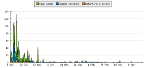

Hoy el [Blog Estatut 2005 ( http://estatut05.blogspot.com )](http://estatut05.blogspot.com/) ha sido cerrado definitivamente. De esta forma no se admitirá más comentarios de sus artículos ni será mantenido de ninguna forma, quedando todo su contenido a la deriva en el universo de Internet.

[Estatut 2005](http://estatut05.blogspot.com/) fue una apuesta personal por realizar un blog donde se [pudiera discutir](http://estatut05.blogspot.com/2005/09/objectiuobjetivo.html) el nuevo texto de [l’Estatut de Catalunya](http://www.gencat.net/nouestatut/) antes de su presentación a las [Cortes Españolas](http://www.congreso.es/).

El blog de Estatut 2005 nació un día después de la aprobación del texto en el [Parlament de Catalunya](http://www.parlament-cat.net/), y se fueron subiendo uno a uno, en catalán y castellano todos los artículos del texto (mil gracias a mi padre que subió más de una 3/4 parte!). El blog tuvo una repercusión mediatica fugaz, tan fugaz como la luz que impacta en una película fotográfica. Apareció en pocos días en [hostalmusica.com](http://www.hostalmusical.com/), el blog de [ComRadio](http://www.comradio.com/), en [periodistas21](http://periodistas21.blogspot.com/), el blog de Juan Valera, en la [Piscina de los hipócritas](http://blocs.mesvilaweb.cat/node/viewComm/11439) o en [@N@ NAUSCOPIO](http://nauscopio.coolfreepages.com/nauscopio_old_z/nauscopio_zB.htm) así como en otros sitios de internet (gracias [Ramon](http://www.casiseguro.com/) por poner algún comentario sobre la existencia del blog en otros blogs). A todos ellos gracias por informar de su nacimiento.

En los primeros días, su expansión dejo de crecer repentidamente quedando los enlaces en las páginas anteriores. Y durante el primer mes y medio, hubo una pequeña participación e intercambios de opiniones. Así pues, gracias también a todos aquellos usuarios que participaron en este blog: cancito, felix, [fidel](http://www.mediastintas.com/), kibe, david y al usuario anónimo. Porque gracias a vosotros pudo disfrutar este blog de su mes más bonito de vida con vuestros comentarios siempre interesantes. Seguro que os tendrá presentes en su nuevo viaje.

Pero poca cosita más… El por qué no ha logrado el éxito, que no era otro que generar mucha discusión alrededor de un tema tan importante como el que trataba se debe a varios motivos, principalmente errores mios. Lo engendré con con mucho amor pero no supe cuidarlo desde en sus primeros días. Desde mi punto de vista los fallos:

-   El formato de un blog para la discusión de l’Estatut es complicado, aún más si están todos los artículos en la página principal; se hace difícil encontrar el artículo que más puede interesarte a opinar y hay demasiado texto para poderte concentrar en participar en algo.
-   Otro error, hacer caso omiso del consejo de Quique, que me sugerió escribir un artículo regularmente desde mi punto de vista sobre las diferentes cuestiones de l’Estatut para generar discusión. Sin duda lo hubiera (re)animado un poco el blog.
-   No dedicar tiempo necesario a un proyecto como este. He estado involucrado un cientos de cosas y aquí necesitaba más dedicación, sobretodo en la promoción del blog, en dar opinión y en arreglar algunos errores del contenido y la forma. Fue un grave error también.

-   Por último, y menos relevante, quizá el tema no despertaba mucho interés…

Si queréis estadísticas de su vida, os incluyo algunas. A excepción de la gráfica, el resto de datos me he basado en las últimas 100 entradas y en mis observaciones durante todo este tiempo:

Como podéis observar el primer mes tuvo bastante actividad. La gran mayoría de entradas provenían de las siguientes páginas web:

-   [lluisr.blogspot.com/2005/10/el-blog-del-estatut-2005.html](http://lluisr.blogspot.com/2005/10/el-blog-del-estatut-2005.html)
-   [www.google.es/blogsearch?hl=es&q=estatut](http://www.google.es/blogsearch?hl=es&q=estatut)
-   [search.blogger.com/?ui=blg&q=estatut](http://search.blogger.com/?ui=blg&q=estatut)
-   [blogsearch.google.com/blogsearch?hl=es&filter=0&q=%22Estatut %22&btnG=Buscar blogs](http://blogsearch.google.com/blogsearch?hl=es&filter=0&amp;q=%22Estatut%20%22&btnG=Buscar%20blogs)
-   [www.hostalmusica.com/comradio/](http://www.hostalmusical.com/comradio/index.php/268)
-   [www.google.com/blogsearch?hl=es&q=estatut&btnG=Buscar blogs](http://www.google.com/blogsearch?hl=es&q=estatut&amp;btnG=Buscar%20blogs)
-   [periodistas21.blogspot.com/2005/10/primer-blog-del-estatut.html](http://periodistas21.blogspot.com/2005/10/primer-blog-del-estatut.html)
-   [blogsearch.google.com/blogsearch?hl=es&amp;amp;amp;amp;amp;ie=UTF-8&filter=0&q= estatut](http://blogsearch.google.com/blogsearch?hl=es&ie=UTF-8&amp;filter=0&q=%20estatut)

Pero más importante en un blog son los comentarios que se dejan independientemente de la cantidad de visitas. Estos han sido:

-   [6 en Los Derechos históricos](http://estatut05.blogspot.com/2005/10/art-5-los-derechos-histricos.html)
-   [5 en La Nación Catalana](http://estatut05.blogspot.com/2005/10/art-1-la-nacin-catalana.html)
-   [4 en Marco Político](http://estatut05.blogspot.com/2005/10/art-3-marco-poltico.html)
-   [2 Símbolos Nacionales](http://estatut05.blogspot.com/2005/10/art-8-smbolos-nacionales.html)

A continuación las páginas o artículos más visitados. Curioso de las tres páginas más visitadas, la segunda y la tercera. Antes que los mismo artículos a debatir, las instrucciones y objetivos del blog eran consultadas con mayor frecuencia. Sana costumbre de los lectores del blog 🙂

-   [estatut05.blogspot.com/](http://estatut05.blogspot.com/)
-   [estatut05.blogspot.com/2005/09/instruccions-instrucciones.html](http://estatut05.blogspot.com/2005/09/instruccions-instrucciones.html)
-   [estatut05.blogspot.com/2005/09/objectiuobjetivo.html](http://estatut05.blogspot.com/2005/09/objectiuobjetivo.html)

Por otro lado, quiero destacar que el blog no fue muy internacional, y es que en apenas un mes de vida real no tuvo tiempo para viajar. Más de la mitad de los visitantes eran catalanes, de la otra mitad, se repartían entre valencianos y madrileños básicamente. Por último, alguna visita por ejemplo, la Repúbl  
ica Checa, Alemania o Francia.

En difinitiva, no he podido darle una vida muy digna, pero si que procuraré darle el descanso definitivo que se merece con este pequeño homenaje. Todo en esta vida tiene un principio y un fin, como el de hoy,

“A fin de cuentas, todo es un chiste.” [Charles Chaplin](http://es.wikipedia.org/wiki/Charlie_Chaplin)