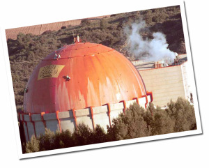
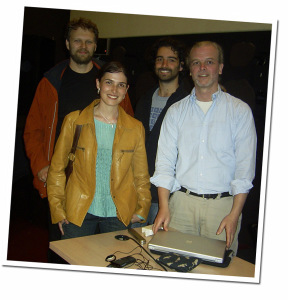
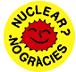

La C.N. José Cabrera, en [Zorita](http://www.albacity.org/), se apaga. La central nuclear más antigua de España, con 40 años de antigüedad proporcionará durante el día de hoy los últimos GWe a la red eléctrica, para comenzar su desmantelación que durará varios años.

Es una gran noticia, pese que los más pesimistas pueden considerarlo como algo imperativamente necesario debido a la antiguedad de la central y no como un paso adelante para abandonar la energía nuclear. Pero esta noticia genera optimismo, de momento no vamos a necesitarla reemplazar con ninguna otra central nuclear nueva.

Y es que las centrales nucleares quedan muy lejos de ser una fuente de energía sostenible. Su creación es cara, su mantenimiento es caro, su ciclo de vida corto y su desmentelamiento es muy caro. Su combustible es un recurso limitado, [requiere de un proceso de extracción y elaboración complejo y es altamente radioactivo en todo su ciclo de vida](http://cipres.cec.uchile.cl/~clpino/impacto.html). Además sirve para construír armamento de una capacidad destructura elevadísima, para justificar actuaciones militares o para fortalecer estados radicales.

Si no hay suficiente con ello, en caso de accidente de una central nuclear esta puede ocasionar muerte, cáncer y leucemia, alteraciones genéticas importantes, problemas respiratorios y cardiovasculares graves, esterilidad de los campos de cultivos y contaminación de la cadena alimenticia humana a todo un territorio tan grande como Europa, siendo [tales efectos multiplicados miles de veces](http://www.pixelpress.org/chernobyl/) en [unos cientos de kilómetros](http://www.kiddofspeed.com/chernobyl-revisited/) de la central accidentada.

Por ello, hoy es un pasito más para abandonar esta energía (aunque [hay países que tienen decenas de ellas a pleno funcionamiento, como Francia](http://www.world-nuclear.org/info/graphics/maps/france.gif)).

Quien quiera más información puede consultar la siguiente página web:

[http://www.energiasostenible.org/](http://www.energiasostenible.org/)

es una asociación catalana de científicos que trabajan para un futuro libre de centrales nucleares, y es muy interesante porque tienen colgado multitud de documentación muy detallada tanto de las centrales nucleares como de otras fuentes de energía. Realmente quizá sea demasiada información para el ciudadano casual que busca información más genérica, pero para ello organizan conferencias interesantes como la que asistimos la pasada semana, y estas son enunciadas en la página web.

Werner, Ester, yo y Mycle en  
“XX Conferència Catalana per Un Futur Sense Nuclars  
i Energèticament Sostenible”

Por mi parte, iré colgando documentos que tengo de la energía nuclear. Para comenzar, el informe de [GreenPeace sobre los efectos de Chernobyl](http://lluisribes.googlepages.com/chernobylhealthreport.pdf), el [resumen del informe elaborado por los verdes para la comisión europea](http://lluisribes.googlepages.com/GreensEFA_the_other_report_on_chernobyl_torch_executivesumma.pdf) sobre [Chernobyl](http://www.flickr.com/photos/tags/chernobyl/) y un [informe del estado de la energía nuclear en el mundo](http://lluisribes.googlepages.com/greensefa_EPdocuments106Nuk_en.pdf), a quien uno de sus autores, Mycle Schneider, tuvimos el placer de conocer y compartir opiniones.

Pero no hay que olvidar que lo más importante para implementar un modelo de energía sostenible pasa por el ciudadano y el uso responsable que hace de ésta.  
