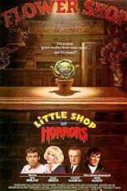
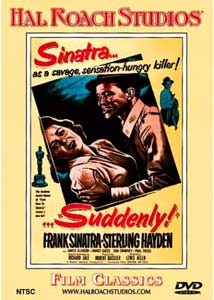

Hola!,

estos días estoy en [Barcelona](http://www.lluisribes.net/www.bcn.es), tranquilamente disfrutando del calor sofocante y de los [mosquitos tigre](http://es.wikipedia.org/wiki/Mosquito_tigre). Estoy aprovechando en ponerme al día mi inglés, que durante estos últimos años no lo he cuidado cometiendo con ello un error. Para ello estoy leyendo un libro que hacía tiempo que me lo habían recomendado: [Made in America](http://www.amazon.co.uk/exec/obidos/ASIN/0552998052) de [Bill Bryson](http://en.wikipedia.org/wiki/Bill_Bryson).

Es un repaso a la historia del inglés en los Estados Unidos pero desde una perspectiva informal llena de historias y anécdotas. Me lo estoy leyendo con mucha atención usando [un buen diccionario](http://www.amazon.com/gp/product/1571456910/102-5023140-5602562?v=glance&n=283155) y me lo estoy pasando muy bien. Llevo pocas páginas, así pues no os lo voy a recomendar de momento…, ¡pero pinta bien!

A la par hago sesión de cine VO en [mi desktop](http://static.flickr.com/45/129338772_cbe946c9b0_b.jpg). Por apenas 9 euros compramos hace unas semanas unas 20 películas de los años 40, 50 y 60 que llevan la etiqueta de “Mitos del Cine” y “Obras Maestras del Cine”. En realidad son películas de segunda categoría, conocidas por los buenos cinéfilos, absolutamente ignoradas por el resto de los mortales.

Ya he realizado dos pases:

[“The little shop of Horrors”](http://www.imdb.com/title/tt0054033/?fr=c2l0ZT1kZnx0dD0xfGZiPXV8cG49MHxrdz0xfHE9bGl0dGxlIHNob3Agb2YgaG9ycm9yfGZ0PTF8bXg9MjB8bG09NTAwfGNvPTF8aHRtbD0xfG5tPTE_;fc=2;ft=20;fm=1) Es la versión original de [la película musical que con el mismo nombre se realizó en los años años 80](http://www.imdb.com/title/tt0091419/?fr=c2l0ZT1kZnx0dD0xfGZiPXV8cG49MHxrdz0xfHE9bGl0dGxlIHNob3Agb2YgaG9ycm9yfGZ0PTF8bXg9MjB8bG09NTAwfGNvPTF8aHRtbD0xfG5tPTE_;fc=1;ft=20;fm=1). Mi opinión es que es bastante cutre ya que los actores, sobretodo [el protagonista](http://www.imdb.com/name/nm0371918/), están un poco flojos a la vez que hay algunos personajes que no acaban de tener sentido en la película. De esta peli, se salva su originalidad (si no has visto ya antes el remake de los años 80) y que tiene un punto de humildad que de alguna forma te engancha. Al fin y al cabo son tan solo 72 minutos que pasan rápidos.

Destacar la aparición de [Jack Nicholson](http://www.imdb.com/name/nm0000197/), cuando era muy joven haciendo un pequeño papel a pesar que en la portada del DVD casi parece ser el actor principal. El personaje que interpreta es cómico y es el de un masoquista que disfruta del dolor cuando visita a su dentista. Es curioso ver a Nicholson en este papel.

En definitiva, la recomiendo si sois muy cinéfilos y queréis ver un clásico porque sino podéis ver el remake, que sin ser una maravilla es mucho más entretenida con el repertorio de canciones que tiene y los buenos actores que participan.

La otra película que he visto es [“Suddenly”](http://www.imdb.com/title/tt0047542/?fr=c2l0ZT1kZnx0dD0xfGZiPXV8cG49MHxrdz0xfHE9U3VkZGVubHl8ZnQ9MXxteD0yMHxsbT01MDB8Y289MXxodG1sPTF8bm09MQ__;fc=2;ft=28;fm=1) traducido en nuestras tierras por “De repente”. Esta película es un thriller sencillito, sin mucho presupuesto pero con una buena dirección y donde el protagonista, [Frank Sinatra](http://www.imdb.com/name/nm0000069/), que hace de malo de la película interpretando el papel de un asesino realiza un interesante trabajo. Está bien y tiene en su desarrollo momentos de tensión muy interesantes a pesar que se nota el bajo presupuesto del que he comentado. Recomendada si quieres ver un Frank Sinatra en el papel de malo así como una peli de intriga correcta.

Estas son las dos películas de estos entrañables DVD que de momento he visto y ahora tengo en la mano [“Dementia 13”](http://www.imdb.com/title/tt0056983/?fr=c2l0ZT1kZnx0dD0xfGZiPXV8cG49MHxrdz0xfHE9RGVtZW50aWEgMTN8ZnQ9MXxteD0yMHxsbT01MDB8Y289MXxodG1sPTF8bm09MQ__;fc=1;ft=21) dirigida por [Francis Ford Coppola](http://www.imdb.com/name/nm0000338/). Esta será seguramente la siguiente candidata a ser vista, a ver que tal.

Y ya que estamos de cine, no os recomiendo que vayáis al cine a ver [“El secreto de Anthony Zimmer”](http://www.imdb.com/title/tt0411118/). No es que sea muy mala, pero esta película francesa tiene un final decepcionante. Esta peli es en teoría uno de esos thrillers que en el final se descubre toda la trama y debes hacer memoria de los detalles y pistas que has visto en la película para construír el complejo puzzle de la trama. Pero todo al contrario, al finalizar comienzas a pensar y no encuentras casi ningún detalle que te hace pensar en que la peli puede acabar como acaba. Tienes la sensación que si la peli hubiera comenzado por el final, el resto de película no te estarías creyendo nada de lo que pasa.

Tan sólo se salva la fantástica interpretación y el cuerpazo de [Sophie Marceau](http://www.cinema-stars.com/sophie/), más que una [chica Bond](http://www.imdb.com/title/tt0143145/). Estáis avisados ;-)…