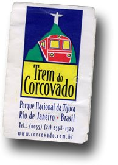

De vuelta con el viaje a Argentina,

os explicaré algunas cosas de las que hice durante los cuatro días que estuve en [Rio de Janeiro](http://es.wikipedia.org/wiki/R%C3%ADo_de_Janeiro_%28ciudad%29) como parte de una pequeña escapada realizada en el viaje de Argentina. En este primer comentario os explicaré la visita al [Cristo Do Corcovado](http://www.corcovado.com.br/). Este es la imágen típica de la ciudad, un cristo de 30 metros que se sitúa en lo alto de un [cerro](http://es.wikipedia.org/wiki/Cerro_del_Corcovado) y donde se disfruta de una de las mejores vistas de la ciudad.

Para ir al Cristo, hay que ir si es posible un día que esté despejado, para sacar buenas fotos. Por tanto, si podéis programar la visita durante cualquier día, esperad a uno que haga buen tiempo y subid. En total la excursión son dos o tres horas como máximo. La mejor forma de llegar es ir en taxi hasta la estación de tren turístico que sube arriba. El taxi lo podéis pedir en el hotel, o también por la calle. En los cuatro días que estuvimos (eramos 4) usabamos sin problema los taxis de la ciudad. Es muy probable, que si agarráis un taxi os ofrezca subir hasta el mismo Cristo de Corcovado, pero no vale la pena. Si así lo hacéis, tendréis que pagar bastante dinero ya que el taxista os esperará para volveros a bajar.

De esta forma, la mejor forma es ir a la estación y cuando lleguéis a la estación ya podréis comenzar a disfrutar de la excursión. El tren, es en realidad un tren cremallera, turístico y bien mantenido que se enfila por la selva de la montaña para llegar arriba de todo, donde nos recibe Cristo con sus brazos abiertos.

En la misma estación se compra el billete y hay una serie de tiendas de souvenirs y ropa muy interesantes para comprar mientras uno espera su turno para subir. Cuando fuí, era Enero (vacaciones en el hemisferio sur) y había mucha cola, pero la espera se hace agradable. A parte de las tiendas que os he comentado, hay un ambiente muy rico, con música carioca, a veces en vivo, y unos ventiladores en el techo que refrescan el ambiente, ya refrescado por unos humedificadores que lanzan agua de tanto en tanto.

El trayecto del tren es muy bueno, y es increíble observar como la ciudad de Rio realmente está entre la jungla, porque a la que se deja la estación, no ves más que vegetación por todas partes. Si queréis podéis preparar las cámaras de fotos, porque casi llegando arriba (10 minutos desde la partida) , hay un par de momentos en que el tren pasa por unos claros que te enseñan una vista fantástica. Pero no os preocupéis demasiado, arriba de todo ya habrá tiempo para fotos espectaculares de la ciudad.

Y es que arriba hay un mirador que permite ver la ciudad prácticamente desde cualquier ángulo. Os dejo un par de montajes que realicé (hacer click para ver en grande):

Una cosa a tener en cuenta, poneros protector solar que arriba hay pocos lugares de sombra y no os espantéis de la cantidad de gente que habrá… 🙂 buscar un rinconcito al lado de la barandilla y disfrutar de la vista. Por último no os olvidéis de la foto del Cristo…:

Antes de bajar con el mismo tren, podéis ir a la terraza y pediros una ensalada de frutas (no es una macedonia…, es una bandeja llena de suculenta fruta fresca) o un batido de vuestras frutas tropicales preferidas. Riquísimo!

Al Cristo hay que ir aún siendo un lugar muy turístico porque es difícil entender la magnitud y la personalidad de Rio sin verla desde un mirador privilegiado como este.

Para acabar, el mismo día que habéis visitado el Cristo os recomiendo cenar en un restaurante japonés que está en la Av. Epitácio Pessoa, 1210 al lado del lago artificial de la ciudad. El restaurante se llama Yasuto Tanaka. Este restaurante, de alta categoría preparan una comida japonesa muy buena con una atención excelente y un ambiente sensacional. Además, de aquí la recomendación de ir después de visitar el Cristo, en la segunda planta tiene una cristalera enorme y las mesas situadas junto a esta disfrutan de una vista del lago y del Cristo coronando la ciudad única, sobretodo de noche. Como no, recomendado para una gran velada con tu pareja.