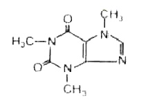

Hace dos días, en una cena muy agradable discutimos sobre un tema parecido al artículo de [Lant’s Blog](http://vicerveza.homeunix.net/~lant/blog): [Extra Caffeine](http://vicerveza.homeunix.net/~lant/blog/archives/2006-08.html#e2006-08-01T19_43_00.txt). Me gustaría contestar el comentario en el mismo [Lant’s Blog](http://vicerveza.homeunix.net/~lant/blog), pero como usa un sistema [tan provocativamente rudimentario](http://nanoblogger.sourceforge.net/) 😉 para publicar sus artículos no se puede contestar en el mismo blog. No importa, abro un hilo en mi humilde espacio.

En definitiva, llegamos a la conclusión que la comunidad de personas que requieren de distintas dosis de café al día para funcionar reclaman un nuevo producto en el mercado:

“El agua con cafeína: el agua que tu necesitas”

Tan sólo esto, nada de refrescos de cafeína con diferentes aromatizantes, bebidas energéticas con sabores de jarabes de la tos o cafés con doble dosis de este estimulante tan venerado. Agua con cafeína y nada más. ¿Os lo imagináis?

Cafeína

  

PD: desconocemos si está en la linea de diseño de alguna empresa