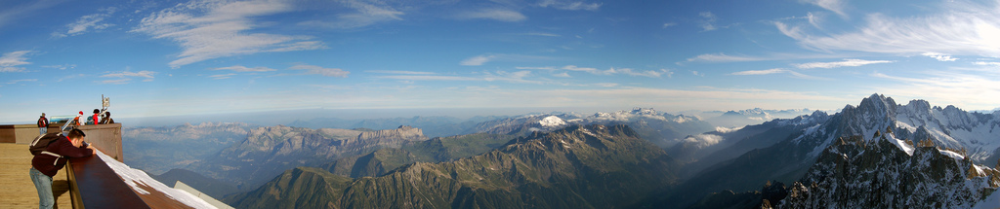
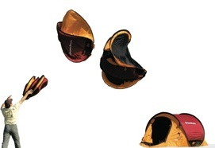

<figure id="attachment_2118" aria-describedby="caption-attachment-2118" style="width: 1014px"><figcaption id="caption-attachment-2118">Vista Aiguille du Midi – Lluís Ribes i Portillo (<a href="http://creativecommons.org/licenses/by-nc-nd/3.0/" target="_blank" rel="noopener noreferrer">cc</a>)</figcaption></figure>

Estoy de vuelta,esta semana pasada hemos estado dando un paseo por los Alpes franceses e italianos tres colegas :). Hemos sobrevivido a [la tienda de campaña 2″](http://www.decathlon.es/ES/Product_arborescence/mountain/hiking/hiking-equipmen/camp-site-tents/product_5599863/index.html):  
a un supuesto ataque nocturno de jabalí (yo no me enteré) así como a otras aventuras.  
Fue un viaje improvisado de un día para otro, con menos trekking del que me hubiera gustado pero con más sitios visitados de los que me podía imaginar.  
Os dejo algunas de las fotos del primer día tras el viaje. La excursión consistió por la mañana en dormir y en buscar un nuevo albergue para los siguientes días y a la tarde ir a la “Nid d’Aigle” con un [cremallera](http://www.compagniedumontblanc.fr/en/tramway/index.html) que salva 1800 metros de desnivel:  
[Fotos primer día](http://flickr.com/search/?q=primer%20dia%20chamonix&w=98472959%40N00)