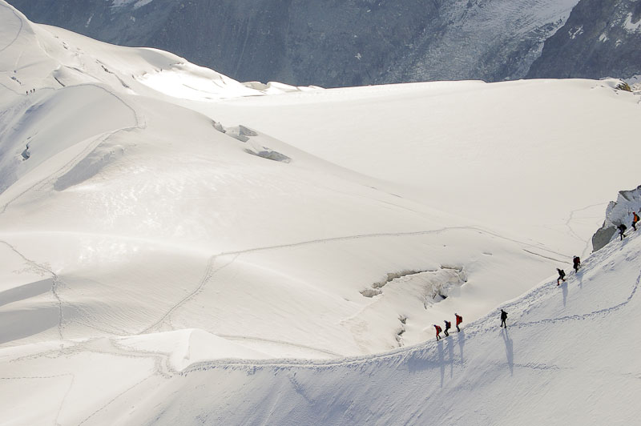

<figure id="attachment_2115" aria-describedby="caption-attachment-2115" style="width: 790px"><figcaption id="caption-attachment-2115">Excursionistas hacia el Mont Blanc – Lluís Ribes i Portillo (<a href="http://creativecommons.org/licenses/by-nc-nd/3.0/" target="_blank" rel="noopener noreferrer">cc</a>)</figcaption></figure>

Segundo día de la escapada a los Alpes,

Todavía estabamos en un refugio prácticamente en el centro de [Chamonix](http://en.wikipedia.org/wiki/Chamonix), muy acogedor y bien de precio. Tuvimos suerte de encontrar una habitación para los tres, pese que era una especie de recibidor de otra habitación donde había una pareja… pero como se iban a dormir antes que nosotros y se levantaban más tarde que nosotros casi ni les vimos el pelo :).  
El segundo día útil, nos levantamos especialmente temprano para ir a l’[Aiguille du Midi](http://en.wikipedia.org/wiki/Aiguille_du_Midi). Es el punto más alto donde un turista (como nuestra expedición) puede subir en los Alpes. Está a 3800 metros. Por descontado el viaje se hace con un teleférico, que parte del mismo Chamonix.  
Hay una parada intermedia, de donde parten muchos caminos de trekking, pero ese día subimos directamente arriba. La impresión en el teleférico es muy grande, pero personalmente me impresionó más ver como los alpinistas se enfilaban por la cresta de la montaña. Con la perspectiva que se tiene en el teleférico parece que estén colgados de un hilo.  
Arriba, en la Aiguille du Midi hay unas vistas impresionantes, mucho frío y un ambiente muy de escalada, porque es uno de los puntos de partida para atacar el Mont Blanc y otras cumbres de los Alpes y está lleno de escaladores con su material de alpinismo preparados para las excursiones. A la vez, observando por las distintas terrazas se puede observar múltiples puntos que se enfilan por todas las montañas nevadas de la zona. Alpinistas en acción. ¡Impresionante!.