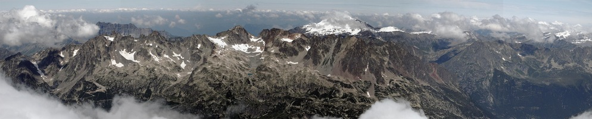
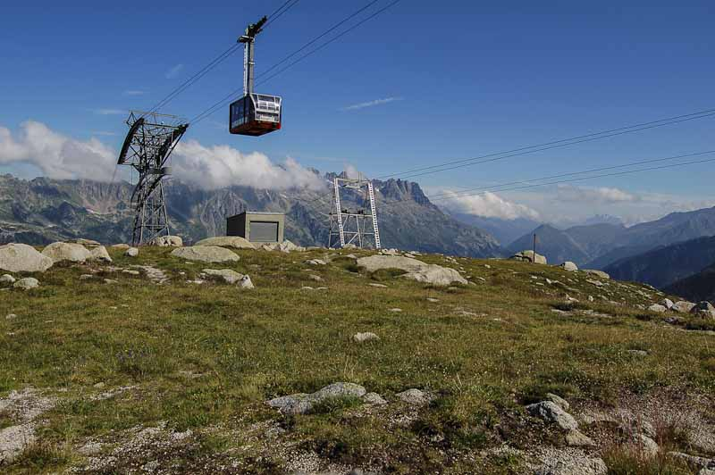
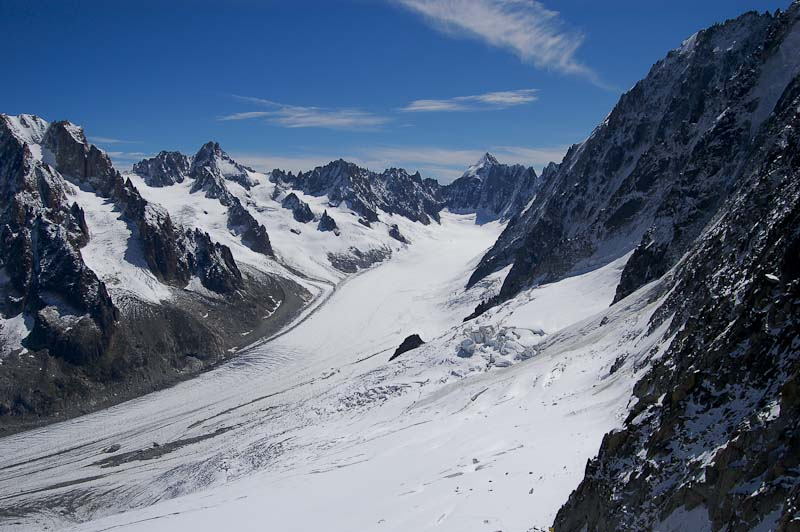

<figure id="attachment_2104" aria-describedby="caption-attachment-2104" style="width: 984px"><figcaption id="caption-attachment-2104">Le Brévent et la Flégère – Lluís Ribes i Portillo (<a href="http://creativecommons.org/licenses/by-nc-nd/3.0/" target="_blank" rel="noopener noreferrer">cc</a>)</figcaption></figure>

  

Más del segundo día…

una vez visitado l’[Aiguille du Midi](http://en.wikipedia.org/wiki/Aiguille_du_Midi), bajamos por el teleférico a toda castaña. La verdad es que si vas a temprana hora a l’Aiguille el viaje de vuelta lo puedes realizar sin hacer colas, y eso se agradece. Una recomendación, si se quiere hacer una excursión de unas dos horas, es bajar en la estación del medio (Plan d’Aiguille) y bajar a [Chamonix](http://en.wikipedia.org/wiki/Chamonix) por alguno de los dos senderos señalizados. Personalmente no lo hicimos pero tiene muy buena pinta descender los 1000 metros de desnivel que hay.

<figure id="attachment_2103" aria-describedby="caption-attachment-2103" style="width: 790px"><figcaption id="caption-attachment-2103">Teleférico Chamonix – Lluís Ribes i Portillo (<a href="http://creativecommons.org/licenses/by-nc-nd/3.0/" target="_blank" rel="noopener noreferrer">cc</a>)</figcaption></figure>

Como teníamos que amortizar un pase de tres días de teleféricos, la bajada al pueblo la hicimos directa y nos dirigimos a [Argentière](http://en.wikipedia.org/wiki/Argenti%C3%A8re). Este pueblo, está a pocos kilómetros de Chamonix dirección la frontera suiza y de él sale otro teleférico bastante espectacular que subre hasta Les Grands Montets, a 3297 metros. Durante el ascenso si se observa con atención se pueden ver castores.

Arriba, como de costumbre un mirador con vistas a imponentes montañas. Destacar el [Aig. Verte](http://www.flickr.com/photos/lluisr/217970775/), en frente del mirador, donde a sus pies parten excursiones de alta montaña y también donde es frecuente encontrar a novatos iniciándose en el alpinismo y practicando la caída controlada con cuerda por la ancha pendiente de la montaña. Y si se sube a la terraza superior, la vista del gran glaciar d’Argentière y de toda la cordillera de Brèvent-Flégére es una maravilla.

<figure id="attachment_2102" aria-describedby="caption-attachment-2102" style="width: 790px"><figcaption id="caption-attachment-2102">Glaciar de Argentière – Lluís Ribes i Portillo (<a href="http://creativecommons.org/licenses/by-nc-nd/3.0/" target="_blank" rel="noopener noreferrer">cc</a>)</figcaption></figure>

Como véis, todo queda cerca, en el mismo día se ha visitado l’Aiguille du Midi y las montañas de Argentière, y todavía queda la tarde…